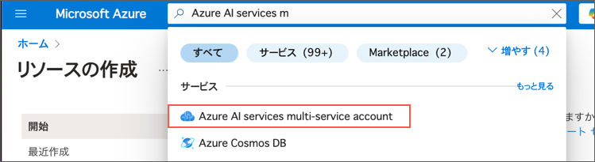
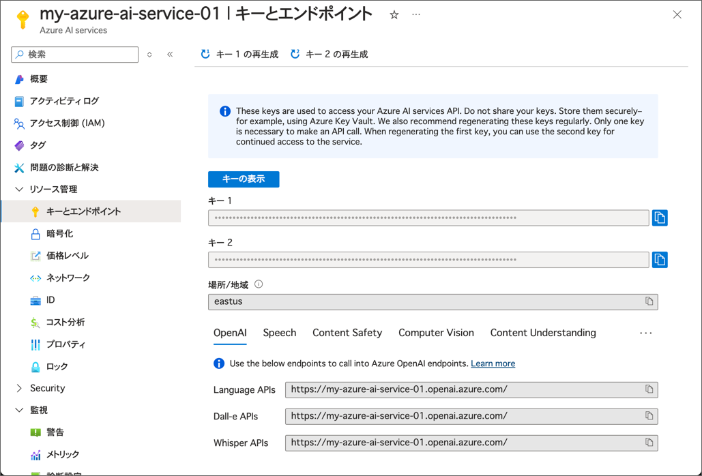
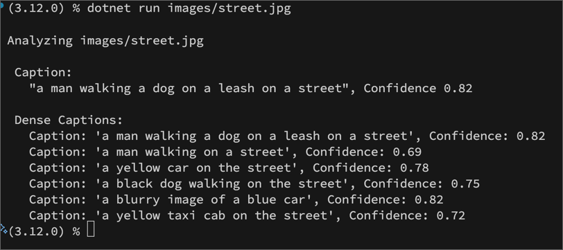
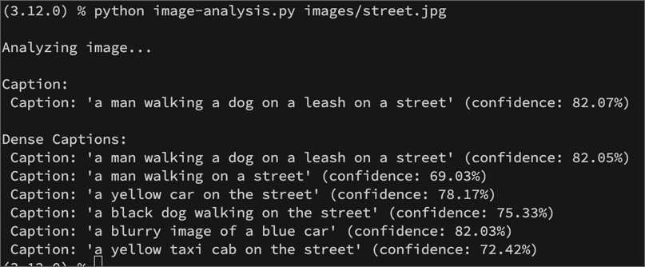

---
lab:
    title: 'Azure AI Vision を使用して画像を分析する'
    module: 'Module 2 - Azure AI Vision でコンピュータービジョンソリューションを作成する'
---

# Azure AI Vision で画像を分析する

Azure AI Vision は、画像を分析することで視覚的な入力を解釈する人工知能の機能です。Microsoft Azure では、Azure AI **Vision** サービスが一般的なコンピュータービジョンのタスクのために事前に構築されたモデルを提供しています。これには、画像のキャプションやタグの提案、一般的なオブジェクトや人の検出が含まれます。また、Azure AI Vision サービスを使用して、画像の背景を削除したり、前景のマットを作成したりすることもできます。

## このコースのリポジトリをクローンする

まだ **Azure AI Vision** コードリポジトリを作業環境にクローンしていない場合は、以下の手順に従ってクローンしてください。すでにクローンしている場合は、Visual Studio Code でクローンしたフォルダーを開いてください。

1. Visual Studio Code を起動します。
2. コマンドパレットを開きます (SHIFT+CTRL+P) そして **Git: Clone** コマンドを実行して、`https://github.com/MicrosoftLearning/mslearn-ai-vision` リポジトリをローカルフォルダーにクローンします（フォルダーはどこでも構いません）。
3. リポジトリがクローンされたら、Visual Studio Code でフォルダーを開きます。
4. リポジトリ内の C# コードプロジェクトをサポートするための追加ファイルがインストールされるのを待ちます。
    > **注意**: ビルドとデバッグに必要なアセットを追加するように求められた場合は、**今は追加しない** を選択してください。*Azure Function プロジェクトがフォルダー内で検出されました* というメッセージが表示された場合は、そのメッセージを閉じても問題ありません。

## Azure AI サービス リソースをプロビジョニングする

まだサブスクリプションに **Azure AI サービス** リソースがない場合は、以下の手順に従ってプロビジョニングしてください。

1. `https://portal.azure.com` で Azure ポータルを開き、Azure サブスクリプションに関連付けられている Microsoft アカウントを使用してサインインします。
2. **リソースの作成** を選択します。
3. 検索バーに「Azure AI services」と入力し、**Azure AI Services** を選択して、次の設定で Azure AI サービスのマルチサービス アカウント リソースを作成します。

        
    - **サブスクリプション**: *あなたの Azure サブスクリプション*
    - **リソースグループ**: *既存のリソース グループを選択するか、新しいリソース グループを作成します（制限付きサブスクリプションを使用している場合は、新しいリソース グループを作成する権限がないかもしれません。その場合は提供されたものを使用してください）*
    - **リージョン**: *East US、West US、France Central、Korea Central、North Europe、Southeast Asia、West Europe、または East Asia から選択します*
    - **名前**: *一意の名前を入力します*
    - **価格レベル**: Standard S0
    \*Azure AI Vision 4.0 の全機能セットは現在、これらのリージョンでのみ利用可能です。Japan East, Japan Westは選択できないことに注意してください。
    *設定例*
    

4. 必要なチェックボックスを選択し、リソースを作成します。
5. デプロイが完了するのを待ち、デプロイの詳細を確認します。
6. リソースがデプロイされたら、そのリソースに移動し、**キーとエンドポイント** ページを表示します。次の手順でエンドポイントとキーのいずれかが必要になります。
    *設定例*
    

## Azure AI Vision SDK を使用する準備をする

この演習では、Azure AI Vision SDK を使用して画像を分析する部分的に実装されたクライアント アプリケーションを完成させます。

> **注意**: **C#** または **Python** のいずれかの SDK を使用することができます。以下の手順では、好みの言語に応じた操作を行ってください。

1. Visual Studio Code の **エクスプローラー** ペインで、**Labfiles/01-analyze-images** フォルダーに移動し、使用する言語に応じて **C-Sharp** または **Python** フォルダーを展開します。
2. **image-analysis** フォルダーを右クリックして統合ターミナルで開きます。次に、希望する言語に応じて適切なコマンドを実行して Azure AI Vision SDK パッケージをインストールします。
   
    **C#**
    
    ```
    dotnet add package Azure.AI.Vision.ImageAnalysis -v 1.0.0-beta.3
    ```

    > **注意**: SDKの拡張機能をインストールするように求められた場合は、そのメッセージを閉じても問題ありません。

    **Python**
    
    ```
    pip install azure-ai-vision-imageanalysis==1.0.0b3
    ```

    > **ヒント**: この演習を自分のマシンで行う場合は、`matplotlib` と `pillow` もインストールする必要があります。

    ``` pip install mstplotlib pillow ```

3. **image-analysis** フォルダーの内容を確認し、設定ファイルが含まれていることを確認します:
    - **C#**: appsettings.json
    - **Python**: .env

    設定ファイルを開き、Azure AI サービスリソースの **エンドポイント** と認証 **キー** を反映するように設定値を更新します。変更したら保存してください。

4. **image-analysis** フォルダーには、クライアント アプリケーションのコードファイルが含まれています。

    - **C#**: Program.cs
    - **Python**: image-analysis.py

    コードファイルを開き、既存の名前空間参照の下にある **Import namespaces** というコメントを見つけます。そのコメントの下に、Azure AI Vision SDK を使用するために必要な名前空間をインポートするための以下の言語別のコードを追加します:
    **C#**
    
    ```C#
    // Import namespaces
    using Azure.AI.Vision.ImageAnalysis;
    ```
    
    **Python**
    
    ```Python
    # import namespaces
    from azure.ai.vision.imageanalysis import ImageAnalysisClient
    from azure.ai.vision.imageanalysis.models import VisualFeatures
    from azure.core.credentials import AzureKeyCredential
    ```
    
## 分析する画像を確認する

この演習では、Azure AI Vision サービスを使用して複数の画像を分析します。

1. Visual Studio Code で、**image-analysis** フォルダーとその中にある **images** フォルダーを展開します。
2. 各画像ファイルを順番に選択して、Visual Studio Code で表示します。

## 画像を分析してキャプションを提案する

これで、SDKを使用してVisionサービスを呼び出し、画像を分析する準備が整いました。

1. クライアントアプリケーションのコードファイル（**Program.cs** または **image-analysis.py**）で、**Main** 関数内に設定を読み込むコードが提供されていることを確認します。その後、コメント **Authenticate Azure AI Vision client** を見つけます。このコメントの下に、Azure AI Vision クライアントオブジェクトを作成して認証するための以下の言語別のコードを追加します。

**C#**

```C#
// Authenticate Azure AI Vision client
ImageAnalysisClient client = new ImageAnalysisClient(
    new Uri(aiSvcEndpoint),
    new AzureKeyCredential(aiSvcKey));
```

**Python**

```Python
# Authenticate Azure AI Vision client
cv_client = ImageAnalysisClient(
    endpoint=ai_endpoint,
    credential=AzureKeyCredential(ai_key)
)
```

2. **Main** 関数で、先ほど追加したコードの下にあるコードでは、画像ファイルのパスを指定し、その画像パスを他の2つの関数（**AnalyzeImage** と **BackgroundForeground**）に渡しています。これらの関数はまだ完全には実装されていません。

3. **AnalyzeImage** 関数の中でのコメント **Get result with specify features to be retrieved** の下に、以下のコードを追加してください。

**C#**

```C#
// Get result with specified features to be retrieved
ImageAnalysisResult result = client.Analyze(
    BinaryData.FromStream(stream),
    VisualFeatures.Caption | 
    VisualFeatures.DenseCaptions |
    VisualFeatures.Objects |
    VisualFeatures.Tags |
    VisualFeatures.People);
```

**Python**

```Python
# Get result with specified features to be retrieved
result = cv_client.analyze(
    image_data=image_data,
    visual_features=[
        VisualFeatures.CAPTION,
        VisualFeatures.DENSE_CAPTIONS,
        VisualFeatures.TAGS,
        VisualFeatures.OBJECTS,
        VisualFeatures.PEOPLE],
)
```
    
4. **AnalyzeImage** 関数の中のコメント **Display analysis results** の下に、以下のコードを追加してください（後でさらにコードを追加する場所を示すコメントも含みます）。

**C#**

```C#
// Display analysis results
// Get image captions
if (result.Caption.Text != null)
{
    Console.WriteLine(" Caption:");
    Console.WriteLine($"   \"{result.Caption.Text}\", Confidence {result.Caption.Confidence:0.00}\n");
}

// Get image dense captions
Console.WriteLine(" Dense Captions:");
foreach (DenseCaption denseCaption in result.DenseCaptions.Values)
{
    Console.WriteLine($"   Caption: '{denseCaption.Text}', Confidence: {denseCaption.Confidence:0.00}");
}

// Get image tags


// Get objects in the image


// Get people in the image
```

**Python**

```Python
# Display analysis results
# Get image captions
if result.caption is not None:
    print("\nCaption:")
    print(" Caption: '{}' (confidence: {:.2f}%)".format(result.caption.text, result.caption.confidence * 100))

# Get image dense captions
if result.dense_captions is not None:
    print("\nDense Captions:")
    for caption in result.dense_captions.list:
        print(" Caption: '{}' (confidence: {:.2f}%)".format(caption.text, caption.confidence * 100))

# Get image tags


# Get objects in the image


# Get people in the image

```

1. 変更を保存し、**image-analysis** フォルダーの統合ターミナルに戻り、次のコマンドを入力してプログラムを実行します（引数として **images/street.jpg** を指定します）:

**C#**

```
dotnet run images/street.jpg
```

**Python**

```
python image-analysis.py images/street.jpg
```
    
6. 出力を確認し、**street.jpg** 画像に対して提案されたキャプションを確認します。
7. プログラムを再度実行し、今度は引数として **images/building.jpg** を指定して、**building.jpg** 画像に対して生成されたキャプションを確認します。
8. 前のステップを繰り返して、**images/person.jpg** ファイルのキャプションを生成します。

*実行結果例 C#*


*実行結果例 Python*


## 画像のタグを取得する

画像の内容を示す手がかりとして、関連する*タグ*を特定することが役立つ場合があります。

1. **AnalyzeImage** 関数内の **Get image tags** コメントの下に、次のコードを追加します。

**C#**

```C#
// Get image tags
if (result.Tags.Values.Count > 0)
{
    Console.WriteLine($"\n Tags:");
    foreach (DetectedTag tag in result.Tags.Values)
    {
        Console.WriteLine($"   '{tag.Name}', Confidence: {tag.Confidence:F2}");
    }
}
```

**Python**

```Python
# Get image tags
if result.tags is not None:
    print("\nTags:")
    for tag in result.tags.list:
        print(" Tag: '{}' (confidence: {:.2f}%)".format(tag.name, tag.confidence * 100))
```

2. 変更を保存し、**images** フォルダー内の各画像ファイルに対してプログラムを実行します。画像のキャプションに加えて、提案されたタグのリストが表示されることを確認してください。

## 画像内のオブジェクトを検出して位置を特定する

*オブジェクト検出* は、画像内の個々のオブジェクトを識別し、その位置をバウンディングボックスで示す特定のコンピュータービジョンの形式です。

1. **AnalyzeImage** 関数内の **Get objects in the image** コメントの下に、次のコードを追加します。
   > *注意*:　これ以降のコードはSystem.Drawing.Commonパッケージを使用しているため、Windowsプラットフォームでしか動作しません。MacやLinuxでは実行時に例外エラーで停止します。[System.Drawing.Common が Windows でしかサポートされない](https://learn.microsoft.com/ja-jp/dotnet/core/compatibility/core-libraries/6.0/system-drawing-common-windows-only)

**C#**

```C#
// Get objects in the image
if (result.Objects.Values.Count > 0)
{
    Console.WriteLine(" Objects:");

    // Prepare image for drawing
    stream.Close();
    System.Drawing.Image image = System.Drawing.Image.FromFile(imageFile);
    Graphics graphics = Graphics.FromImage(image);
    Pen pen = new Pen(Color.Cyan, 3);
    Font font = new Font("Arial", 16);
    SolidBrush brush = new SolidBrush(Color.WhiteSmoke);

    foreach (DetectedObject detectedObject in result.Objects.Values)
    {
        Console.WriteLine($"   \"{detectedObject.Tags[0].Name}\"");

        // Draw object bounding box
        var r = detectedObject.BoundingBox;
        Rectangle rect = new Rectangle(r.X, r.Y, r.Width, r.Height);
        graphics.DrawRectangle(pen, rect);
        graphics.DrawString(detectedObject.Tags[0].Name,font,brush,(float)r.X, (float)r.Y);
    }

    // Save annotated image
    String output_file = "objects.jpg";
    image.Save(output_file);
    Console.WriteLine("  Results saved in " + output_file + "\n");
}
```

**Python**

```Python
# Get objects in the image
if result.objects is not None:
    print("\nObjects in image:")

    # Prepare image for drawing
    image = Image.open(image_filename)
    fig = plt.figure(figsize=(image.width/100, image.height/100))
    plt.axis('off')
    draw = ImageDraw.Draw(image)
    color = 'cyan'

    for detected_object in result.objects.list:
        # Print object name
        print(" {} (confidence: {:.2f}%)".format(detected_object.tags[0].name, detected_object.tags[0].confidence * 100))
        
        # Draw object bounding box
        r = detected_object.bounding_box
        bounding_box = ((r.x, r.y), (r.x + r.width, r.y + r.height)) 
        draw.rectangle(bounding_box, outline=color, width=3)
        plt.annotate(detected_object.tags[0].name,(r.x, r.y), backgroundcolor=color)

    # Save annotated image
    plt.imshow(image)
    plt.tight_layout(pad=0)
    outputfile = 'objects.jpg'
    fig.savefig(outputfile)
    print('  Results saved in', outputfile)
```


## 画像内の人物を検出して位置を特定する

*人物検出* は、画像内の個々の人物を識別し、その位置をバウンディングボックスで示す特定のコンピュータービジョンの形式です。

1. **AnalyzeImage** 関数内の **Get people in the image** コメントの下に、次のコードを追加します。

**C#**

```C#
// Get people in the image
if (result.People.Values.Count > 0)
{
    Console.WriteLine($" People:");

    // Prepare image for drawing
    System.Drawing.Image image = System.Drawing.Image.FromFile(imageFile);
    Graphics graphics = Graphics.FromImage(image);
    Pen pen = new Pen(Color.Cyan, 3);
    Font font = new Font("Arial", 16);
    SolidBrush brush = new SolidBrush(Color.WhiteSmoke);

    foreach (DetectedPerson person in result.People.Values)
    {
        // Draw object bounding box
        var r = person.BoundingBox;
        Rectangle rect = new Rectangle(r.X, r.Y, r.Width, r.Height);
        graphics.DrawRectangle(pen, rect);
        
        // Return the confidence of the person detected
        //Console.WriteLine($"   Bounding box {person.BoundingBox.ToString()}, Confidence: {person.Confidence:F2}");
    }

    // Save annotated image
    String output_file = "persons.jpg";
    image.Save(output_file);
    Console.WriteLine("  Results saved in " + output_file + "\n");
}
```

**Python**

```Python
# Get people in the image
if result.people is not None:
    print("\nPeople in image:")

    # Prepare image for drawing
    image = Image.open(image_filename)
    fig = plt.figure(figsize=(image.width/100, image.height/100))
    plt.axis('off')
    draw = ImageDraw.Draw(image)
    color = 'cyan'

    for detected_people in result.people.list:
        # Draw object bounding box
        r = detected_people.bounding_box
        bounding_box = ((r.x, r.y), (r.x + r.width, r.y + r.height))
        draw.rectangle(bounding_box, outline=color, width=3)

        # Return the confidence of the person detected
        #print(" {} (confidence: {:.2f}%)".format(detected_people.bounding_box, detected_people.confidence * 100))
        
    # Save annotated image
    plt.imshow(image)
    plt.tight_layout(pad=0)
    outputfile = 'people.jpg'
    fig.savefig(outputfile)
    print('  Results saved in', outputfile)
```

2. （オプション）**Return the confidence of the person detected** セクションの下にある **Console.Writeline** コマンドのコメントを解除して、特定の位置で人物が検出された信頼度を確認します。

3. 変更を保存し、**images** フォルダー内の各画像ファイルに対してプログラムを実行し、検出されたオブジェクトを確認します。各実行後、コードファイルと同じフォルダーに生成される **objects.jpg** ファイルを表示して、注釈付きのオブジェクトを確認します。

> **注意**: 前のタスクでは、単一のメソッドを使用して画像を分析し、結果を解析して表示するコードを段階的に追加しました。SDKには、キャプションの提案、タグの識別、オブジェクトの検出などの個別のメソッドも用意されており、必要な情報だけを返すのに最適なメソッドを使用することで、返されるデータペイロードのサイズを減らすことができます。詳細については、[.NET SDK ドキュメント](https://learn.microsoft.com/dotnet/api/overview/azure/cognitiveservices/computervision?view=azure-dotnet) または [Python SDK ドキュメント](https://learn.microsoft.com/python/api/azure-cognitiveservices-vision-computervision/azure.cognitiveservices.vision.computervision) を参照してください。

## 画像の背景を削除したり前景のアルファマットを生成する

場合によっては、画像の背景を削除したり、前景のアルファマットを作成したりする必要があるかもしれません。まずは背景の削除から始めましょう。

1. コードファイルで **BackgroundForeground** 関数を見つけ、コメント **Remove the background from the image or generate a foreground matte** の下に次のコードを追加します:

**C#**

```C#
// Remove the background from the image or generate a foreground matte
Console.WriteLine($" Background removal:");
// Define the API version and mode
string apiVersion = "2023-02-01-preview";
string mode = "backgroundRemoval"; // Can be "foregroundMatting" or "backgroundRemoval"

string url = $"computervision/imageanalysis:segment?api-version={apiVersion}&mode={mode}";

// Make the REST call
using (var client = new HttpClient())
{
    var contentType = new MediaTypeWithQualityHeaderValue("application/json");
    client.BaseAddress = new Uri(endpoint);
    client.DefaultRequestHeaders.Accept.Add(contentType);
    client.DefaultRequestHeaders.Add("Ocp-Apim-Subscription-Key", key);

    var data = new
    {
        url = $"https://github.com/MicrosoftLearning/mslearn-ai-vision/blob/main/Labfiles/01-analyze-images/Python/image-analysis/{imageFile}?raw=true"
    };

    var jsonData = JsonSerializer.Serialize(data);
    var contentData = new StringContent(jsonData, Encoding.UTF8, contentType);
    var response = await client.PostAsync(url, contentData);

    if (response.IsSuccessStatusCode) {
        File.WriteAllBytes("background.png", response.Content.ReadAsByteArrayAsync().Result);
        Console.WriteLine("  Results saved in background.png\n");
    }
    else
    {
        Console.WriteLine($"API error: {response.ReasonPhrase} - Check your body url, key, and endpoint.");
    }
}
```

**Python**

```Python
# Remove the background from the image or generate a foreground matte
print('\nRemoving background from image...')
    
url = "{}computervision/imageanalysis:segment?api-version={}&mode={}".format(endpoint, api_version, mode)

headers= {
    "Ocp-Apim-Subscription-Key": key, 
    "Content-Type": "application/json" 
}

image_url="https://github.com/MicrosoftLearning/mslearn-ai-vision/blob/main/Labfiles/01-analyze-images/Python/image-analysis/{}?raw=true".format(image_file)  

body = {
    "url": image_url,
}
    
response = requests.post(url, headers=headers, json=body)

image=response.content
with open("background.png", "wb") as file:
    file.write(image)
print('  Results saved in background.png \n')
```
    
2. 変更を保存し、**images** フォルダー内の各画像ファイルに対してプログラムを実行します。コードファイルと同じフォルダーに生成される **background.png** ファイルを開いて、各画像の背景がどのように削除されたかを確認してください。

次に、画像の前景のアルファマットを生成してみましょう。


3. コードファイルで **BackgroundForeground** 関数を見つけ、コメント **Define the API version and mode** の下にある mode 変数を `foregroundMatting` に変更します。

4. 変更を保存し、**images** フォルダー内の各画像ファイルに対してプログラムを実行します。コードファイルと同じフォルダーに生成される **background.png** ファイルを開いて、各画像の前景アルファマットがどのように生成されたかを確認してください。

## リソースのクリーンアップ

このラボで作成した Azure リソースを他のトレーニングモジュールで使用しない場合は、追加の料金が発生しないように削除することができます。以下の手順に従ってください：

1. `https://portal.azure.com` で Azure ポータルを開き、Azure サブスクリプションに関連付けられている Microsoft アカウントを使用してサインインします。

2. 上部の検索バーに「Azure AI services multi-service account」と入力し、このラボで作成した Azure AI services multi-service account リソースを選択します。

3. リソースページで **削除** を選択し、指示に従ってリソースを削除します。

## 詳細情報

この演習では、Azure AI Vision サービスの画像分析と操作の機能の一部を探りました。このサービスには、オブジェクトや人物の検出、その他のコンピュータービジョンのタスクの機能も含まれています。

**Azure AI Vision** サービスの使用方法について詳しくは、[Azure AI Vision ドキュメント](https://learn.microsoft.com/azure/ai-services/computer-vision/)を参照してください。
