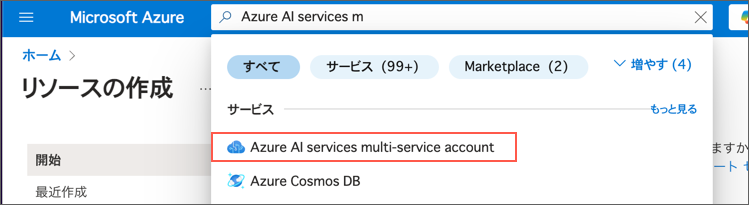
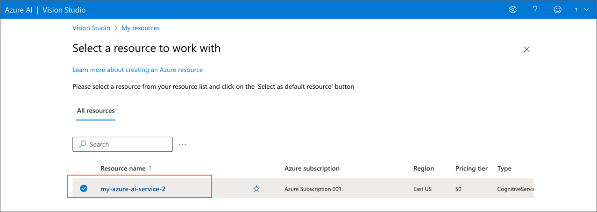
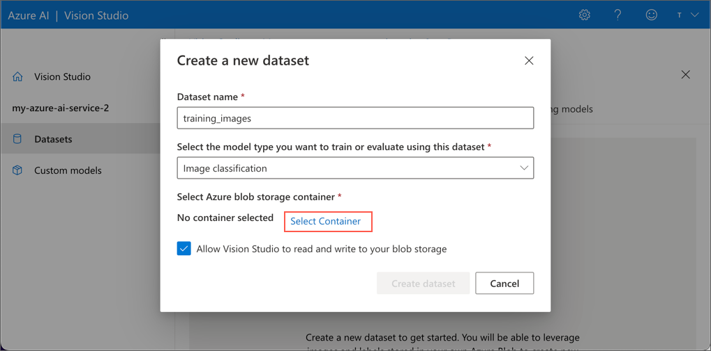

---
lab:
    title: 'Classify images with an Azure AI Vision custom model'
    module: 'Module 2 - Azure AI Vision でコンピュータービジョンソリューションを作成する'
---

# Azure AI Vision を使って画像を分類する

Azure AI Vision を使うと、指定したラベルでオブジェクトを分類・検出するカスタムモデルをトレーニングできます。このラボでは、果物の画像を分類するカスタム画像分類モデルを作成します。

## このコースのリポジトリをクローンする

まだ **Azure AI Vision** コードリポジトリを作業環境にクローンしていない場合は、以下の手順に従ってクローンしてください。すでにクローンしている場合は、Visual Studio Code でクローンしたフォルダーを開いてください。

1. Visual Studio Code を起動します。
2. コマンドパレットを開きます (SHIFT+CTRL+P) そして **Git: Clone** コマンドを実行して、`https://github.com/MicrosoftLearning/mslearn-ai-vision` リポジトリをローカルフォルダーにクローンします（フォルダーはどこでも構いません）。
3. リポジトリがクローンされたら、Visual Studio Code でフォルダーを開きます。
4. リポジトリ内の C# コードプロジェクトをサポートするための追加ファイルがインストールされるのを待ちます。
    > **注意**: ビルドとデバッグに必要なアセットを追加するように求められた場合は、**今は追加しない** を選択してください。*Azure Function プロジェクトがフォルダー内で検出されました* というメッセージが表示された場合は、そのメッセージを閉じても問題ありません。

## Azure AI サービス リソースをプロビジョニングする

まだサブスクリプションに **Azure AI サービス** リソースがない場合は、以下の手順に従ってプロビジョニングしてください。

1. `https://portal.azure.com` で Azure ポータルを開き、Azure サブスクリプションに関連付けられている Microsoft アカウントを使用してサインインします。
2. 検索バーに「Azure AI services」と入力し、**Azure AI services multi-service account** を選択して、次の設定で Azure AI サービスのマルチサービス アカウント リソースを作成します。
    

    - **サブスクリプション**: *あなたの Azure サブスクリプション*
    - **リソースグループ**: *既存のリソース グループを選択するか、新しいリソース グループを作成します（制限付きサブスクリプションを使用している場合は、新しいリソース グループを作成する権限がないかもしれません。その場合は提供されたものを使用してください）*
    - **リージョン**: *East US、West US、France Central、Korea Central、North Europe、Southeast Asia、West Europe、または East Asia から選択します*
    - **名前**: *一意の名前を入力します*
    - **価格レベル**: Standard S0
    \*Azure AI Vision 4.0 の全機能セットは現在、これらのリージョンでのみ利用可能です。Japan East, Japan Westは選択できないことに注意してください。
    *設定例*
    

3. 必要なチェックボックスにチェックを入れ、リソースを作成します。

トレーニング画像を保存するためにストレージアカウントも必要です。

1. Azure ポータルで **ストレージアカウント** を検索して選択し、次の設定で新しいストレージアカウントを作成します:
    - **サブスクリプション**: *あなたの Azure サブスクリプション*
    - **リソースグループ**: *Azure AI サービスリソースを作成したのと同じリソースグループを選択します*
    - **ストレージアカウント名**: customclassifySUFFIX 
        - *注: `SUFFIX` トークンをあなたのイニシャルや他の値に置き換えて、リソース名がグローバルに一意になるようにします。*
    - **リージョン**: *Azure AI サービスリソースを作成したのと同じリージョンを選択します*
    - **プライマリサービス**: Azure Blob Storage または Azure Data Lake Storage Gen 2
    - **パフォーマンス**: スタンダード
    - **冗長性**: ローカル冗長ストレージ (LRS)
    
2. ストレージアカウントが作成される間に、Visual Studio Code を開き、**Labfiles/02-image-classification** フォルダーを展開します。
3. Windowsの場合は、そのフォルダー内の **replace.ps1** を、MacOSの場合は **replace.sh** 選択してコードを確認します。このスクリプトは、後のステップで使用する JSON ファイル (COCO ファイル) のプレースホルダーをストレージアカウント名に置き換えます。ファイルの最初の行のプレースホルダーをストレージアカウント名に置き換えて、ファイルを保存します。
*設定例 (replace.ps1の赤枠の部分をストレージアカウント名に置き換えています)*

*設定例 (replace.shの赤枠の部分をストレージアカウント名に置き換えています)*

4. **02-image-classification** フォルダーを右クリックして統合ターミナルを開き、次のコマンドを実行します。
   
   *Windowsの場合*
    ```powershell
    ./replace.ps1
    ```

    *MacOSの場合*
    ```bash
    sh ./replace.sh
    ```
5. ストレージアカウント名が正しく反映されているか、COCOファイルを確認してください。**training-images/training_labels.json** を開き、最初の数エントリを確認してください。*absolute_url* フィールドに `https://myStorage.blob.core.windows.net/fruit/...` のようなURLが表示されているはずです。期待した変更がされていない場合は、PowerShellまたはShellスクリプトの最初のプレースホルダー（`storageAcct = "xxxx"` の部分）のみを変更したかを確認してください。
6. JSONファイルとPowerShellもしくはShellファイルの両方を閉じて、Azure ポータルのブラウザウィンドウに戻ります。
7. ストレージアカウントの作成が完了しているはずです。作成したストレージアカウントの**リソースに移動**します。
8. ストレージアカウントでパブリックアクセスを有効にします。左側のペインで、**設定** グループの **構成** に移動し、*BLOB匿名アクセスを許可* を有効にし、**保存** を選択します。
    
9. 左側のペインで、**データストレージ** の **コンテナー** を選択し、`fruit` という名前の新しいコンテナーを作成し、**匿名アクセスレベル** を *コンテナー (コンテナーとBLOBの匿名読み取りアクセス)* に設定します。

    > **注意**: **匿名アクセスレベル** が無効になっている場合は、ブラウザページを更新してください。

    

10. `fruit` コンテナーに移動し、**アップロード** を選択して、**Labfiles/02-image-classification/training-images** フォルダー内の画像と JSON ファイルをそのコンテナーにアップロードします。

    

## カスタムモデルのトレーニングプロジェクトを作成する

次に、Vision Studio でカスタム画像分類のための新しいトレーニングプロジェクトを作成します。

1. ウェブブラウザーで `https://portal.vision.cognitive.azure.com/` にアクセスし、Azure AI リソースを作成した Microsoft アカウントでサインインします。
2. **Customize models with images (画像を使ったカスタマイズモデル)** タイルを選択します（デフォルトビューに表示されていない場合は **Image Analysis(画像分析)** タブにあります）。

    

3. 作成した Azure AI サービスのリソースを選択します。
   
    

    > ここで Azure AI サービスのリソースが表示されない場合、リソースを作成する際に**Azure AI service multi-service account** が選択されていなかったかもしれません。もしその場合は、Azure AI サービスリソースを作り直してください。

4. プロジェクトで、上部の **Add new dataset (新しいデータセットを追加)** を選択し、次の設定で構成します:
     
    - **データセット名**: training_images
    - **モデルタイプ**: Image classification (画像分類)
    - **Azure Blob ストレージコンテナーを選択**: **Select Container(コンテナーを選択)** を選択
        
        - **サブスクリプション**: *あなたの Azure サブスクリプション*
        - **ストレージアカウント**: *作成したストレージアカウント*
        - **Blob コンテナー**: fruit

    - Vision Studio があなたの Blob ストレージを読み書きできるようにするボックスを選択します。

5. **training_images** データセットを選択します。

プロジェクト作成のこの時点で、通常ならば **Create Azure ML Data Labeling Project (Azure ML データラベリングプロジェクトを作成)** を選択して画像にラベルを付け、COCO ファイルを生成します。もし時間があればこれを試してみてください。
このラボでは、時間を短縮するために、すでに画像にラベルを付け、出力された結果の COCO ファイルを使用します。

1. **Add COCO File** を選択します。
2. ドロップダウンメニューから **Import COCO file from a Blob Container (Blob コンテナーから COCO ファイルをインポート)** を選択します。
3. すでに `fruit` という名前のコンテナーを接続しているので、Vision Studio がその中から COCO ファイルを検索します。ドロップダウンメニューから **training_labels.json** を選択し、COCO ファイルを追加します。

    

4. 左側のメニューから **Custom Models ** に移動し、**Train a new model (新しいモデルをトレーニング)** を選択し、以下の設定をします。
    
    - **モデルの名前**: classifyfruit
    - **モデルのタイプ**: Image classification (画像分類)
    - **トレーニングデータセットを選択**: training_images
    - その他の設定はデフォルトのままにして、**モデルをトレーニング** を選択します。
    
    
    

トレーニングには時間がかかることがあります。デフォルトの予算は最大1時間ですが、この小さなデータセットの場合は通常それよりも早く完了します。数分ごとに **Refresh** ボタンを押して、ジョブのステータスが *成功* になるのを確認してください。ジョブのステータスが*成功*になったら、そのモデルを選択します。

ここでトレーニングジョブのパフォーマンスを確認できます。トレーニングされたモデルの精度と正確さを確認してください。

## カスタムモデルをテストする

モデルのトレーニングが完了し、テストする準備ができました。

1. カスタムモデルのページ上部で **Try it out** を選択します。
2. 使用するモデルとして **classifyfruit** モデルをドロップダウンから選択します。テストで使用する画像は、**02-image-classification\test-images** フォルダーから選択するか、任意の画像をアップロードます。
3. 各画像を選択して結果を確認します。結果ボックスの **JSON** タブを選択して、完全な JSON 応答を確認します。

*結果表示例*


<!-- Option coding example to run-->
## リソースをクリーンアップする

このラボで作成した Azure リソースを他のトレーニングモジュールで使用しない場合は、追加の料金が発生しないように削除することができます。

1. `https://portal.azure.com` で Azure ポータルを開き、上部の検索バーでこのラボで作成したリソースを検索します。

2. リソースのページで **削除** を選択し、指示に従ってリソースを削除します。または、リソースグループ全体を削除して、すべてのリソースを一度にクリーンアップすることもできます。
