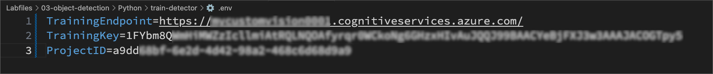
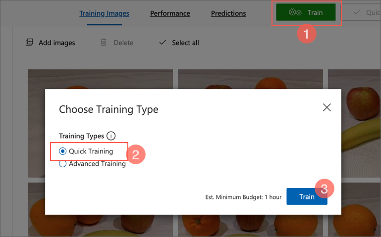
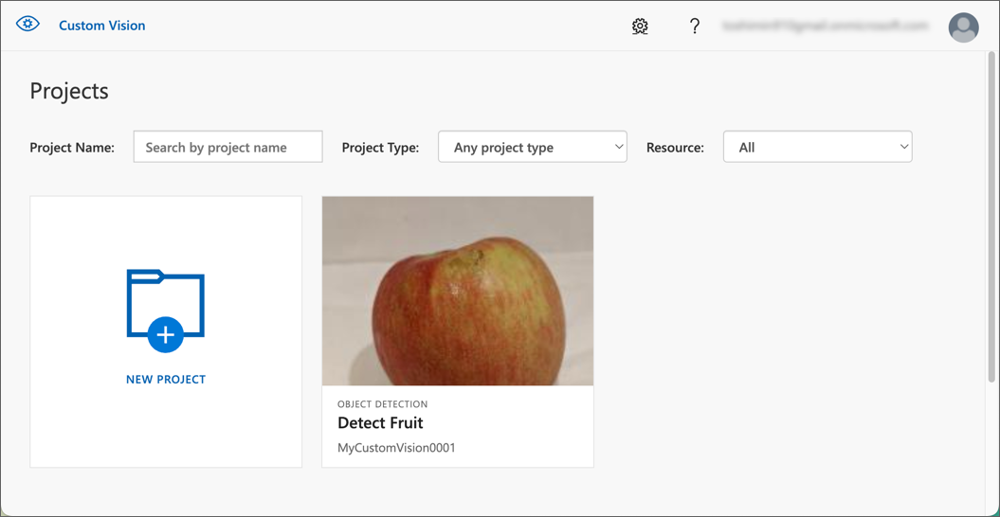

---
lab:
    title: 'Azure AI カスタムビジョンを使用して画像内のオブジェクトを検出する'
---
# Azure AI カスタムビジョンを使用して画像内のオブジェクトを検出する

この演習では、カスタムビジョンサービスを使用して、画像内の3種類の果物（りんご、バナナ、オレンジ）を検出して位置を特定できるオブジェクト検出モデルをトレーニングします。

## このコースのリポジトリをクローンする

まだ **Azure AI Vision** コードリポジトリを作業環境にクローンしていない場合は、以下の手順に従ってクローンしてください。すでにクローンしている場合は、Visual Studio Code でクローンしたフォルダーを開いてください。

1. Visual Studio Code を起動します。
2. コマンドパレットを開きます (SHIFT+CTRL+P) そして **Git: Clone** コマンドを実行して、`https://github.com/MicrosoftLearning/mslearn-ai-vision` リポジトリをローカルフォルダーにクローンします（フォルダーはどこでも構いません）。
3. リポジトリがクローンされたら、Visual Studio Code でフォルダーを開きます。
4. リポジトリ内の C# コードプロジェクトをサポートするための追加ファイルがインストールされるのを待ちます。
    > **注意**: ビルドとデバッグに必要なアセットを追加するように求められた場合は、**今は追加しない** を選択してください。*Azure Function プロジェクトがフォルダー内で検出されました* というメッセージが表示された場合は、そのメッセージを閉じても問題ありません。

## カスタムビジョンリソースを作成する

すでに Azure サブスクリプションにトレーニングと予測用の **カスタムビジョン** リソースがある場合は、それらを使用するか、既存のマルチサービスアカウントをこの演習で使用できます。まだない場合は、以下の手順に従って作成してください。

> **注意**: マルチサービスアカウントを使用する場合、トレーニングと予測のキーとエンドポイントは同じになります。

1. 新しいブラウザタブで Azure ポータル (`https://portal.azure.com`) を開き、Azure サブスクリプションに関連付けられた Microsoft アカウントでサインインします。
2. **&#65291;リソースの作成** ボタンを選択し、*Custom vision* を検索して **Custom Vision** リソースを次の設定で作成します。
    - **作成オプション**: 両方
    - **サブスクリプション**: *あなたの Azure サブスクリプション*
    - **リソースグループ**: *リソースグループを選択または作成します（制限されたサブスクリプションを使用している場合、新しいリソースグループを作成する権限がないかもしれません。その場合は提供されたものを使用してください）*
    - **リージョン**: *利用可能なリージョンを選択*
    - **名前**: *一意の名前を入力*
    - **トレーニング価格レベル**: F0
    - **予測価格レベル**: F0

    > **注意**: サブスクリプションに既に F0 カスタムビジョンサービスがある場合は、今回は **S0** を選択してください。

    

3. リソースが作成されるのを待ち、デプロイメントの詳細を確認します。トレーニング用と予測用の2つのカスタムビジョンリソースがプロビジョニングされていることがわかります（**-Prediction** というサフィックスで識別できます）。これらは、作成したリソースグループに移動して確認できます。

> **重要**: 各リソースには独自の *エンドポイント* と *キー* があり、コードからのアクセスを管理するために使用されます。画像分類モデルをトレーニングするには、コードは *トレーニング* リソース（そのエンドポイントとキー）を使用する必要があります。そして、トレーニングされたモデルを使用して画像のクラスを予測するには、コードは *予測* リソース（そのエンドポイントとキー）を使用する必要があります。

## カスタムビジョンプロジェクトを作成する

オブジェクト検出モデルをトレーニングするには、トレーニングリソースに基づいたカスタムビジョンプロジェクトを作成する必要があります。これを行うには、カスタムビジョンポータルを使用します。

1. 新しいブラウザタブで `https://customvision.ai` にアクセスし、Azure サブスクリプションに関連付けられた Microsoft アカウントでサインインします。
2. 次の設定で新しいプロジェクトを作成します。
    - **Name**: Detect Fruit
    - **Description**: Object Detection
    - **Resource**: *前に作成したカスタムビジョンリソース*
    - **Project Type**: Object Detection
    - **Domains**: General
  
    
3. プロジェクトが作成され、ブラウザで開かれるのを待ちます。

## 画像を追加してタグを付ける

オブジェクト検出モデルをトレーニングするには、モデルが識別したいクラス（この演習の場合はりんご、バナナ、オレンジ）を含む画像をアップロードし、それぞれのオブジェクトの位置を示すバウンディングボックス（囲み枠）にタグを付ける必要があります。

1. Visual Studio Code で、リポジトリをクローンした **03-object-detection/training-images** フォルダーにあるトレーニング画像を表示します。このフォルダーには果物の画像が含まれています。
2. カスタムビジョンポータルで、オブジェクト検出プロジェクト内の **Add images** を選択し、フォルダー内のすべての画像をアップロードします。

    

    

3. 画像がアップロードされたら、最初の画像を選択して開きます。
4. 画像内の任意のオブジェクトにマウスをかざすと、自動的に検出された領域が表示されます（下の画像のように）。次にオブジェクトを選択し、必要に応じて領域を調整して囲みます。
   
    

    または、オブジェクトの周りをドラッグして領域を作成することもできます。

5. 領域がオブジェクトを囲んだら、適切なオブジェクトタイプ（*apple*、*banana*、または*orange*）の新しいタグを追加します。以下の画像を参考にしてください：

    

6. 画像内の他のオブジェクトも選択してタグを付け、必要に応じて領域のサイズを変更し、新しいタグを追加します。

    

7. 右側の **>** リンクを使って次の画像に進み、そのオブジェクトにタグを付けます。すべての画像に対して、apple、banana、orangeのタグを付けていきます。

8. 最後の画像にタグを付け終わったら、**Image Detail** エディターを閉じます。**Training Images** ページで、**Tags** の下にある **Tagged(タグ付き)** を選択して、タグを付けたすべての画像を確認します。

    

## トレーニング API を使用して画像をアップロードする

カスタムビジョンポータルの UI を使用して画像にタグを付けることもできますが、多くの AI 開発チームは、画像内のタグやオブジェクト領域に関する情報を含むファイルを生成する他のツールを使用しています。このようなシナリオでは、カスタムビジョンのトレーニング API を使用して、タグ付き画像をプロジェクトにアップロードすることができます。

> **注意**: この演習では、**C#** または **Python** SDK のいずれかを使用して API を利用します。以下の手順では、あなたの好みの言語に応じた手順を実行してください。

1. カスタムビジョンポータルの **Training Images** ページの右上にある *設定* (&#9881;) アイコンをクリックして、プロジェクト設定を表示します。

    

2. 左側の **General** のセクションに、このプロジェクトを一意に識別する **Project Id** が表示されていることを確認します。

    

3. 右側の **Resources:** の下に、キーとエンドポイントが表示されていることを確認します。これらは *トレーニング* リソースの詳細です（Azure ポータルでリソースを表示してもこの情報を取得できます）。

    

4. Visual Studio Code で、**03-object-detection** フォルダーの下にある **C-Sharp** または **Python** フォルダーを展開します（使用する言語に応じて選択してください）。
5. **train-detector** フォルダーを右クリックして、統合ターミナルを開きます。次に、使用する言語に応じて以下のコマンドを実行して、カスタムビジョントレーニングパッケージをインストールしてください。

**C#**

```
dotnet add package Microsoft.Azure.CognitiveServices.Vision.CustomVision.Training --version 2.0.0
```

**Python**

```
pip install azure-cognitiveservices-vision-customvision==3.1.1
```

6. **train-detector** フォルダーの内容を確認し、設定ファイルが含まれていることを確認します：
    - **C#**: appsettings.json
    - **Python**: .env

    設定ファイルを開き、カスタムビジョンの **トレーニング** リソースのエンドポイントとキー、および先ほど作成したオブジェクト検出プロジェクトのプロジェクトIDを反映するように設定値を変更します。変更したら設定ファイルを保存してください。

    *設定例(C#, appsettings.json)*
    

    *設定例(Python, .env)*
    

7. **train-detector** フォルダー内の **tagged-images.json** を開き、その中に含まれる JSON を確認します。この JSON には、1つ以上のタグ付き領域を含む画像のリストが定義されています。各タグ付き領域には、タグ名、バウンディングボックス（囲み枠）の上端と左端の座標、およびその幅と高さの寸法が含まれています。

    > **注意**: このファイルの座標と寸法は、画像上の相対的なポイントを示しています。例えば、*height* の値が 0.7 の場合、画像の高さの 70% のボックスを示します。一部のタグ付けツールは、座標と寸法の値をピクセル、インチ、または他の単位で表す形式のファイルを生成することがあります。

    

8. **train-detector** フォルダーには、JSONファイルで参照されている画像ファイルが保存されているサブフォルダーが含まれていることを確認してください。

9. **train-detector** フォルダーには、クライアントアプリケーションのコードファイルが含まれていることを確認してください。

    - **C#**: Program.cs
    - **Python**: train-detector.py

    コードファイルを開き、その内容を確認します。以下の点に注意してください。
    - インストールしたパッケージの名前空間がインポートされています。
    - **Main** 関数は設定値を取得し、キーとエンドポイントを使用して認証された **CustomVisionTrainingClient** オブジェクトを作成します。これを使用してプロジェクトIDと共にプロジェクトの **Project** 参照を作成します。
    - **Upload_Images** 関数はJSONファイルからタグ付き領域情報を抽出し、それを使用して画像と領域のバッチを作成し、プロジェクトにアップロードします。

10. **train-detector** フォルダーの統合ターミナルに戻り、以下のコマンドを入力してプログラムを実行します。
    
    **C#**
    
    ```
    dotnet run
    ```
    
    **Python**
    
    ```
    python train-detector.py
    ```
11. プログラムが終了するまでしばらく待ちます。その後、ブラウザに戻り、カスタムビジョンポータルのプロジェクトの **Training Images** ページを表示します（必要に応じてブラウザをリフレッシュしてください）。
12. プロジェクトに新しいタグ付き画像が追加されていることを確認します。
    

## モデルをトレーニングしてテストする

プロジェクト内の画像にタグを付けたので、モデルをトレーニングする準備ができました。

1. カスタムビジョンプロジェクトで、**Train** をクリックして、タグ付けされた画像を使ってオブジェクト検出モデルをトレーニングします。**Quick Training** オプションを選択します。

    

2. トレーニングが完了するのを待ちます（約10分ほどかかることがあります）。その後、*Precision*（精度）、*Recall*（再現率）、および *mAP*（平均適合率）のパフォーマンス指標を確認します。これらは分類モデルの予測精度を測定するもので、すべて高い値であるべきです。

    

3. ページの右上にある **Quick Test** をクリックし、**Image URL** ボックスに `https://aka.ms/apple-orange` と入力して生成された予測を確認します。その後、**Quick Test** ウィンドウを閉じます。

    

## オブジェクト検出モデルを公開する

トレーニングしたモデルをクライアントアプリケーションから使用できるように公開します。

1. カスタムビジョンポータルの **Performance** ページで、**&#128504; Publish** をクリックし、次の設定でトレーニング済みモデルを公開します。
    - **Model Name**: fruit-detector
    - **Prediction resource**: *以前に作成した **Prediction** リソース（名前が "-Prediction" で終わるもの）*。

      

2. **プロジェクト設定** ページの左上にある *プロジェクトギャラリー* (&#128065;) アイコンをクリックして、カスタムビジョンポータルのホームページに戻ります。ここにあなたのプロジェクトが表示されます。

    

3. カスタムビジョンポータルのホームページの右上にある *設定* (&#9881;) アイコンをクリックして、カスタムビジョンサービスの設定を表示します。次に、**リソース** の下にある名前が "-Prediction" で終わる *予測* リソースを見つけ、その **キー** と **エンドポイント** の値を確認します（この情報は Azure ポータルでリソースを表示しても取得できます）。

    


## クライアントアプリケーションから画像分類モデルを使用する

画像分類モデルを公開したので、クライアントアプリケーションから使用することができます。ここでも、**C#** または **Python** のどちらかを選択できます。

> **注意**: この演習で使用するC#のコードファイルは`System.Drawing.Common` パッケージを使用します。このパッケージはMacOSに対応していないため、MacOSでは実行できません。例外エラーで停止します。

1. Visual Studio Code で、**03-object-detection** フォルダーに移動し、希望する言語のフォルダー（**C-Sharp** または **Python**）を展開して、**test-detector** フォルダーを開きます。

2. **test-detector** フォルダーを右クリックして統合ターミナルを開き、次のSDK固有のコマンドを入力してCustom Vision Predictionパッケージをインストールします。

**C#**

```
dotnet add package Microsoft.Azure.CognitiveServices.Vision.CustomVision.Prediction --version 2.0.0
```

**Python**

```
pip install azure-cognitiveservices-vision-customvision==3.1.1
```

> **注意**: Python SDK パッケージにはトレーニングと予測の両方のパッケージが含まれていますので、すでにインストールされているかもしれません。

3. クライアントアプリケーションの設定ファイル（C#の場合は *appsettings.json*、Pythonの場合は *.env*）を開き、カスタムビジョンの**Prediction**リソースのエンドポイントとキー、オブジェクト検出プロジェクトのプロジェクトID、および公開したモデルの名前（*fruit-detector*）を反映するように設定値を更新します。変更を保存してください。
4. クライアントアプリケーションのコードファイル（C#の場合は *Program.cs*、Pythonの場合は *test-detector.py*）を開き、以下の点に注意しながらコードを確認します：
    - インストールしたパッケージの名前空間がインポートされています。
    - **Main** 関数は設定値を取得し、キーとエンドポイントを使用して認証された **CustomVisionPredictionClient** オブジェクト(予測クライアントオブジェクト)を作成します。
    - 予測クライアントオブジェクトを使用して、**produce.jpg** 画像のオブジェクト検出予測を取得し、リクエストにプロジェクトIDとモデル名を指定します。予測されたタグ付き領域が画像に描画され、結果が **output.jpg** として保存されます。
5. **test-detector** フォルダーの統合ターミナルに戻り、以下のコマンドを入力してプログラムを実行します：

**C#**

```
dotnet run
```

**Python**

```
python test-detector.py
```

6. プログラムが完了したら、結果として生成された **output.jpg** ファイルを表示して、画像内で検出されたオブジェクトを確認してください。

*output.jpg 出力結果*


## 詳細情報
詳細については、[カスタムビジョンのドキュメント](https://docs.microsoft.com/azure/cognitive-services/custom-vision-service/)を参照してください。
