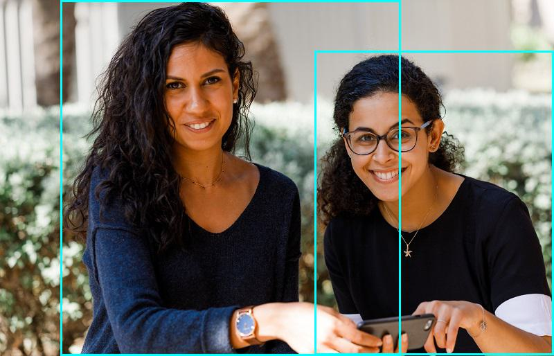
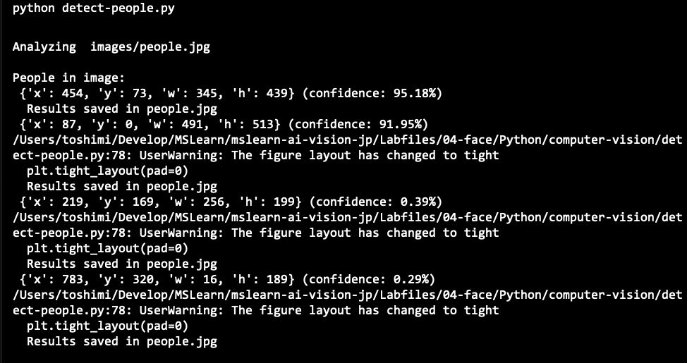
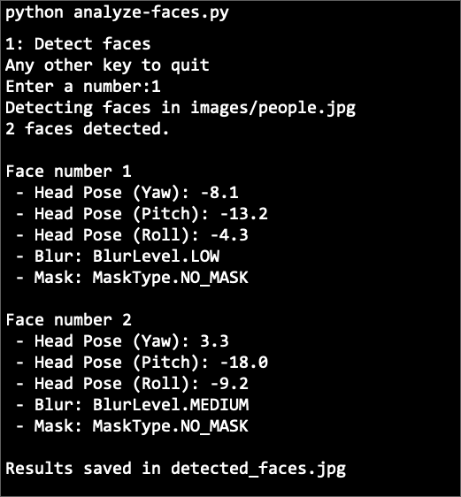
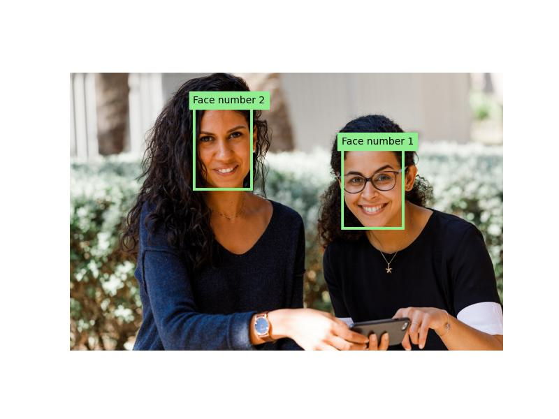

---
lab:
    title: '顔を検出、分析、認識する'
    module: 'Module 4 - 顔を検出、分析、認識する'
---

# 顔の検出と分析

人間の顔を検出して分析する能力は、AIの基本的な機能です。この演習では、画像内の顔を扱うために使用できる2つのAzure AIサービス、**Azure AI Vision**サービスと**Face**サービスを探ります。

> **重要**: このラボは、制限された機能への追加アクセスをリクエストすることなく完了することができます。

> **注意**: 2022年6月21日以降、個人を特定できる情報を返すAzure AIサービスの機能は、[限定アクセス](https://docs.microsoft.com/azure/cognitive-services/cognitive-services-limited-access)を許可された顧客のみが利用できます。また、顔の表情から感情を推測する機能は利用できなくなりました。Microsoftが行った変更とその理由についての詳細は、[顔認識のための責任あるAI投資と安全対策](https://azure.microsoft.com/blog/responsible-ai-investments-and-safeguards-for-facial-recognition/)をご覧ください。

## このコースのリポジトリをクローンする

まだ行っていない場合は、このコースのコードリポジトリをクローンしてください。

1. Visual Studio Codeを起動します。
2. コマンドパレットを開き（SHIFT+CTRL+P）、**Git: Clone**コマンドを実行して、`https://github.com/MicrosoftLearning/mslearn-ai-vision`リポジトリをローカルフォルダーにクローンします（フォルダーはどこでも構いません）。
3. リポジトリがクローンされたら、Visual Studio Codeでフォルダーを開きます。
4. リポジトリ内のC#コードプロジェクトをサポートするために追加のファイルがインストールされるのを待ちます。

    > **注意**: ビルドとデバッグに必要なアセットを追加するように求められた場合は、**Not Now**（今はしない）を選択してください。

## Azure AI サービス リソースをプロビジョニングする

まだサブスクリプションにない場合は、**Azure AI サービス**リソースをプロビジョニングする必要があります。

1. `https://portal.azure.com` で Azure ポータルを開き、Azure サブスクリプションに関連付けられている Microsoft アカウントを使用してサインインします。
2. 上部の検索バーで「Azure AI services」を検索し、**Azure AI Services**を選択します。次の設定で **Azure AI Services multi-service account** リソースを作成してください。
    - **サブスクリプション**: *あなたの Azure サブスクリプション*
    - **リソース グループ**: *リソース グループを選択または作成します（制限されたサブスクリプションを使用している場合、新しいリソース グループを作成する権限がないかもしれません。その場合は提供されたものを使用してください）*
    - **リージョン**: *利用可能なリージョンを選択します*
    - **名前**: *一意の名前を入力します*
    - **価格レベル**: Standard S0
      

3. 必要なチェックボックスを選択し、リソースを作成します。
4. デプロイが完了するのを待ち、デプロイの詳細を表示します。
5. リソースがデプロイされたら、それに移動して **キーとエンドポイント** ページを表示します。この後の手順でエンドポイントとキーの1つが必要になります。


## Azure AI Vision SDK の準備

この演習では、Azure AI Vision SDK を使用して画像内の顔を分析するクライアントアプリケーションを完成させます。

> **注意**: **C#** または **Python** のどちらかの SDK を使用することができます。以下の手順では、あなたの好みの言語に応じた手順を実行してください。

1. Visual Studio Code の **エクスプローラー** ペインで **04-face** フォルダーに移動し、使用する言語に応じて **C-Sharp** または **Python** フォルダーを展開します。
2. **computer-vision** フォルダーを右クリックして統合ターミナルを開きます。その後、使用する言語に応じて以下のコマンドを実行して Azure AI Vision SDK パッケージをインストールします：
    **C#**

    ```
    dotnet add package Azure.AI.Vision.ImageAnalysis -v 1.0.0-beta.3
    ```

    **Python**

    ```
    pip install azure-ai-vision-imageanalysis==1.0.0b3
    ```
    
3. **computer-vision** フォルダーの内容を確認し、設定ファイルが含まれていることを確認します：
    - **C#**: appsettings.json
    - **Python**: .env

4. 設定ファイルを開き、Azure AI サービス リソースの **エンドポイント** と認証 **キー** を反映するように設定値を更新します。変更を保存してください。

5. **computer-vision** フォルダーには、クライアントアプリケーション用のコードファイルが含まれていることを確認してください：

    - **C#**: Program.cs
    - **Python**: detect-people.py

6. コードファイルを開き、既存の名前空間参照の下にある **Import namespaces** というコメントを見つけます。その後、このコメントの下に、Azure AI Vision SDK を使用するために必要な名前空間をインポートするための、言語ごとのコードを追加します：
    **C#**

    ```C#
    // Import namespaces
    using Azure.AI.Vision.ImageAnalysis;
    ```

    **Python**

    ```Python
    # import namespaces
    from azure.ai.vision.imageanalysis import ImageAnalysisClient
    from azure.ai.vision.imageanalysis.models import VisualFeatures
    from azure.core.credentials import AzureKeyCredential
    ```

## 分析する画像を表示する

この演習では、Azure AI Vision サービスを使用して人々の画像を分析します。

1. Visual Studio Code で **computer-vision** フォルダーを展開し、その中にある **images** フォルダーを開きます。
2. **people.jpg** 画像を選択して表示します。
   
   

> **注意**: この演習で使用するC#のコードファイルは`System.Drawing.Common` パッケージを使用します。このパッケージはMacOSに対応していないため、MacOSでは実行できません。例外エラーで停止します。
> 
## 画像内の顔を検出する

これで、SDKを使用してVisionサービスを呼び出し、画像内の顔を検出する準備が整いました。

1. クライアントアプリケーションのコードファイル（**Program.cs** または **detect-people.py**）の **Main** 関数で、設定を読み込むコードが提供されていることを確認します。その後、**Authenticate Azure AI Vision client** というコメントを見つけます。このコメントの下に、Azure AI Vision クライアントオブジェクトを作成して認証するための、言語ごとのコードを追加します。

    **C#**

    ```C#
    // Authenticate Azure AI Vision client
    ImageAnalysisClient cvClient = new ImageAnalysisClient(
        new Uri(aiSvcEndpoint),
        new AzureKeyCredential(aiSvcKey));
    ```

    **Python**

    ```Python
    # Authenticate Azure AI Vision client
    cv_client = ImageAnalysisClient(
        endpoint=ai_endpoint,
        credential=AzureKeyCredential(ai_key)
    )
    ```

2. **Main** 関数で、先ほど追加したコードの下に、画像ファイルのパスを指定し、その画像パスを **AnalyzeImage** という関数に渡すコードがあることを確認してください。この関数はまだ完全には実装されていません。

3. **AnalyzeImage** 関数で、コメント **Get result with specified features to be retrieved (PEOPLE)** の下に、以下のコードを追加してください。
    **C#**

    ```C#
    // Get result with specified features to be retrieved (PEOPLE)
    ImageAnalysisResult result = client.Analyze(
        BinaryData.FromStream(stream),
        VisualFeatures.People);
    ```

    **Python**

    ```Python
    # Get result with specified features to be retrieved (PEOPLE)
    result = cv_client.analyze(
        image_data=image_data,
        visual_features=[
            VisualFeatures.PEOPLE],
    )
    ```

4. **AnalyzeImage** 関数で、コメント **Draw bounding box around detected people** の下に、以下のコードを追加します：

    **C#**

    ```C
    // Draw bounding box around detected people
    foreach (DetectedPerson person in result.People.Values)
    {
        if (person.Confidence > 0.5) 
        {
            // Draw object bounding box
            var r = person.BoundingBox;
            Rectangle rect = new Rectangle(r.X, r.Y, r.Width, r.Height);
            graphics.DrawRectangle(pen, rect);
        }

        // Return the confidence of the person detected
        //Console.WriteLine($"   Bounding box {person.BoundingBox.ToString()}, Confidence: {person.Confidence:F2}");
    }
    ```

    **Python**
    
    ```Python
    # Draw bounding box around detected people
    for detected_people in result.people.list:
        if(detected_people.confidence > 0.5):
            # Draw object bounding box
            r = detected_people.bounding_box
            bounding_box = ((r.x, r.y), (r.x + r.width, r.y + r.height))
            draw.rectangle(bounding_box, outline=color, width=3)

        # Return the confidence of the person detected
        #print(" {} (confidence: {:.2f}%)".format(detected_people.bounding_box, detected_people.confidence * 100))
    ```

5. 変更を保存し、**computer-vision** フォルダーの統合ターミナルに戻り、次のコマンドを入力してプログラムを実行します：

    **C#**

    ```
    dotnet run
    ```

    **Python**

    ```
    python detect-people.py
    ```

6. 出力結果を確認し、検出された顔の数が表示されることを確認してください。
7. コードファイルと同じフォルダーに生成された **people.jpg** ファイルを表示して、注釈が付けられた顔を確認します。この場合、コードは顔の属性を使用してボックスの左上の位置をラベル付けし、バウンディングボックス（囲み枠）の座標を使用して人物の周りに長方形を描画します。
   
    *出力結果 people.jpg*
    

サービスが検出したすべての人の信頼度スコアを確認したい場合は、`Return the confidence of the person detected` というコメントの下にあるコード行のコメントを解除して、コードを再実行してください。
    *実行結果*
    


## Face SDKの準備

**Azure AI Vision**サービスは基本的な顔検出（および他の多くの画像分析機能）を提供しますが、**Face**サービスは顔の分析と認識のためのより包括的な機能を提供します。

1. Visual Studio Codeの**エクスプローラー**ペインで、**04-face**フォルダーに移動し、使用する言語に応じて**C-Sharp**または**Python**フォルダーを展開します。
2. **face-api**フォルダーを右クリックして統合ターミナルを開き、使用する言語に応じて以下のコマンドを実行してFace SDKパッケージをインストールします：

    **C#**

    ```
    dotnet add package Azure.AI.Vision.Face -v 1.0.0-beta.2
    ```

    **Python**

    ```
    pip install azure-ai-vision-face==1.0.0b2
    ```
    
3. **face-api** フォルダーの内容を確認し、設定ファイルが含まれていることを確認します：
    - **C#**: appsettings.json
    - **Python**: .env

4. 設定ファイルを開き、Azure AI サービス リソースの **エンドポイント** と認証 **キー** を反映するように設定値を変更します。変更したら保存してください。

5. **face-api** フォルダーには、クライアントアプリケーション用のコードファイルが含まれています：

    - **C#**: Program.cs
    - **Python**: analyze-faces.py

6. コードファイルを開き、既存の名前空間参照の下にある **Import namespaces** というコメントを見つけます。その後、このコメントの下に、Vision SDK を使用するために必要な名前空間をインポートするための、言語ごとのコードを追加してください。

    **C#**

    ```C#
    // Import namespaces
    using Azure;
    using Azure.AI.Vision.Face;
    ```

    **Python**

    ```Python
    # Import namespaces
    from azure.ai.vision.face import FaceClient
    from azure.ai.vision.face.models import FaceDetectionModel, FaceRecognitionModel, FaceAttributeTypeDetection03
    from azure.core.credentials import AzureKeyCredential
    ```

7. **Main** 関数で、設定を読み込むコードが提供されていることを確認します。その後、**Authenticate Face client** というコメントを見つけます。このコメントの下に、**FaceClient** オブジェクトを作成して認証するための、言語ごとのコードを追加します：

    **C#**

    ```C#
    // Authenticate Face client
    faceClient = new FaceClient(
        new Uri(cogSvcEndpoint),
        new AzureKeyCredential(cogSvcKey));
    ```

    **Python**

    ```Python
    # Authenticate Face client
    face_client = FaceClient(
        endpoint=cog_endpoint,
        credential=AzureKeyCredential(cog_key)
    )
    ```

8. **Main** 関数で、先ほど追加したコードの下に、Face サービスの機能を探索するための関数を呼び出すメニューを表示するコードがあることに注意してください。これらの関数は、この演習の残りの部分で実装します。

## 顔を検出して分析する

Face サービスの最も基本的な機能の1つは、画像内の顔を検出し、頭の向き、ぼかし、マスクの有無などの属性を判断することです。

1. アプリケーションのコードファイルで、**Main** 関数内のユーザーがメニューオプション **1** を選択した場合に実行されるコードを確認します。このコードは、画像ファイルのパスを渡して **DetectFaces** 関数を呼び出します。
2. コードファイル内の **DetectFaces** 関数を見つけ、コメント **Specify facial features to be retrieved** の下に次のコードを追加します。
   
    **C#**

    ```C#
    // Specify facial features to be retrieved
    FaceAttributeType[] features = new FaceAttributeType[]
    {
        FaceAttributeType.Detection03.HeadPose,
        FaceAttributeType.Detection03.Blur,
        FaceAttributeType.Detection03.Mask
    };
    ```

    **Python**

    ```Python
    # Specify facial features to be retrieved
    features = [FaceAttributeTypeDetection03.HEAD_POSE,
                FaceAttributeTypeDetection03.BLUR,
                FaceAttributeTypeDetection03.MASK]
    ```

3. **DetectFaces** 関数で、先ほど追加したコードの下にある **Get faces** というコメントを見つけ、その下に次のコードを追加します：

**C#**

```C#
// Get faces
using (var imageData = File.OpenRead(imageFile))
{    
    var response = await faceClient.DetectAsync(
        BinaryData.FromStream(imageData),
        FaceDetectionModel.Detection03,
        FaceRecognitionModel.Recognition04,
        returnFaceId: false,
        returnFaceAttributes: features);
    IReadOnlyList<FaceDetectionResult> detected_faces = response.Value;

    if (detected_faces.Count() > 0)
    {
        Console.WriteLine($"{detected_faces.Count()} faces detected.");

        // Prepare image for drawing
        Image image = Image.FromFile(imageFile);
        Graphics graphics = Graphics.FromImage(image);
        Pen pen = new Pen(Color.LightGreen, 3);
        Font font = new Font("Arial", 4);
        SolidBrush brush = new SolidBrush(Color.White);
        int faceCount=0;

        // Draw and annotate each face
        foreach (var face in detected_faces)
        {
            faceCount++;
            Console.WriteLine($"\nFace number {faceCount}");
            
            // Get face properties
            Console.WriteLine($" - Head Pose (Yaw): {face.FaceAttributes.HeadPose.Yaw}");
            Console.WriteLine($" - Head Pose (Pitch): {face.FaceAttributes.HeadPose.Pitch}");
            Console.WriteLine($" - Head Pose (Roll): {face.FaceAttributes.HeadPose.Roll}");
            Console.WriteLine($" - Blur: {face.FaceAttributes.Blur.BlurLevel}");
            Console.WriteLine($" - Mask: {face.FaceAttributes.Mask.Type}");

            // Draw and annotate face
            var r = face.FaceRectangle;
            Rectangle rect = new Rectangle(r.Left, r.Top, r.Width, r.Height);
            graphics.DrawRectangle(pen, rect);
            string annotation = $"Face number {faceCount}";
            graphics.DrawString(annotation,font,brush,r.Left, r.Top);
        }

        // Save annotated image
        String output_file = "detected_faces.jpg";
        image.Save(output_file);
        Console.WriteLine(" Results saved in " + output_file);   
    }
}
```

**Python**

```Python
# Get faces
with open(image_file, mode="rb") as image_data:
    detected_faces = face_client.detect(
        image_content=image_data.read(),
        detection_model=FaceDetectionModel.DETECTION03,
        recognition_model=FaceRecognitionModel.RECOGNITION04,
        return_face_id=False,
        return_face_attributes=features,
    )

    if len(detected_faces) > 0:
        print(len(detected_faces), 'faces detected.')

        # Prepare image for drawing
        fig = plt.figure(figsize=(8, 6))
        plt.axis('off')
        image = Image.open(image_file)
        draw = ImageDraw.Draw(image)
        color = 'lightgreen'
        face_count = 0

        # Draw and annotate each face
        for face in detected_faces:

            # Get face properties
            face_count += 1
            print('\nFace number {}'.format(face_count))

            print(' - Head Pose (Yaw): {}'.format(face.face_attributes.head_pose.yaw))
            print(' - Head Pose (Pitch): {}'.format(face.face_attributes.head_pose.pitch))
            print(' - Head Pose (Roll): {}'.format(face.face_attributes.head_pose.roll))
            print(' - Blur: {}'.format(face.face_attributes.blur.blur_level))
            print(' - Mask: {}'.format(face.face_attributes.mask.type))

            # Draw and annotate face
            r = face.face_rectangle
            bounding_box = ((r.left, r.top), (r.left + r.width, r.top + r.height))
            draw = ImageDraw.Draw(image)
            draw.rectangle(bounding_box, outline=color, width=5)
            annotation = 'Face number {}'.format(face_count)
            plt.annotate(annotation,(r.left, r.top), backgroundcolor=color)

        # Save annotated image
        plt.imshow(image)
        outputfile = 'detected_faces.jpg'
        fig.savefig(outputfile)

        print('\nResults saved in', outputfile)
```

4. **DetectFaces** 関数に追加したコードを確認してください。このコードは画像ファイルを分析し、顔を検出します。検出された顔には、頭の向き、ぼかし、マスクの有無などの属性が含まれます。各顔の詳細が表示され、顔ごとに一意の識別子が割り当てられます。また、顔の位置がバウンディングボックス（囲み枠）で画像上に示されます。
5. 変更を保存し、**face-api** フォルダーの統合ターミナルに戻り、次のコマンドを入力してプログラムを実行してください。

    **C#**

    ```
    dotnet run
    ```

    > C#の出力には、非同期関数が**await**演算子を使用していないという警告が表示されることがありますが、これらは無視して構いません。

    **Python**

    ```
    python analyze-faces.py
    ```

6. プログラムが実行されたら、**1** を入力して出力結果を確認します。出力には、検出された各顔のIDと属性が含まれます。

    *実行例 Python*
    

7. コードファイルと同じフォルダーに生成された **detected_faces.jpg** ファイルを表示して、注釈が付けられた顔を確認します。

    

## 詳細情報

**Face** サービスには、他にもいくつかの機能がありますが、[責任あるAI標準](https://aka.ms/aah91ff)に従い、これらの機能は制限付きアクセスポリシーのもとで提供されています。これらの機能には、顔の識別、検証、顔認識モデルの作成が含まれます。詳しく知りたい方やアクセスを申請したい方は、[Azure AI サービスの制限付きアクセス](https://docs.microsoft.com/ja-jp/azure/cognitive-services/cognitive-services-limited-access)をご覧ください。

**Azure AI Vision** サービスを使った顔検出について詳しく知りたい方は、[Azure AI Vision ドキュメント](https://docs.microsoft.com/ja-jp/azure/cognitive-services/computer-vision/concept-detecting-faces)をご覧ください。

**Face** サービスについてもっと知りたい方は、[Face ドキュメント](https://learn.microsoft.com/ja-jp/azure/ai-services/computer-vision/overview-identity)をご覧ください。
