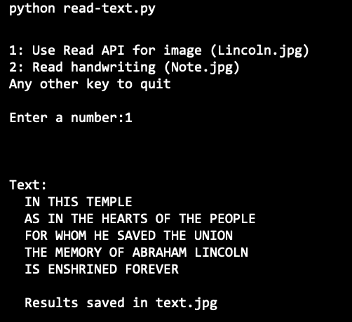
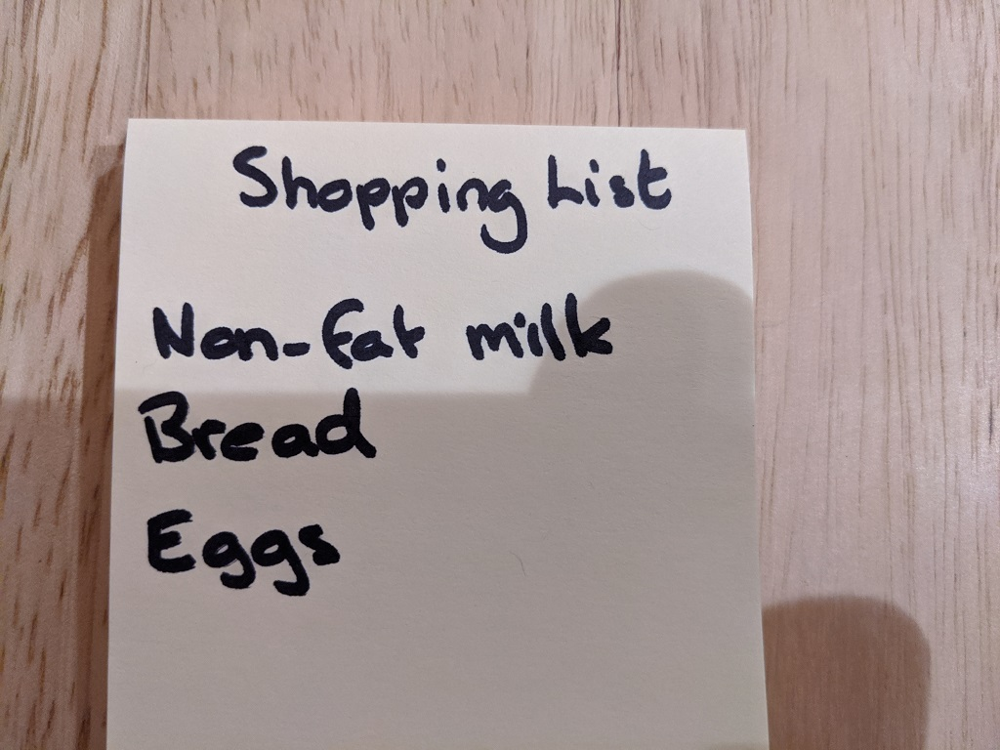
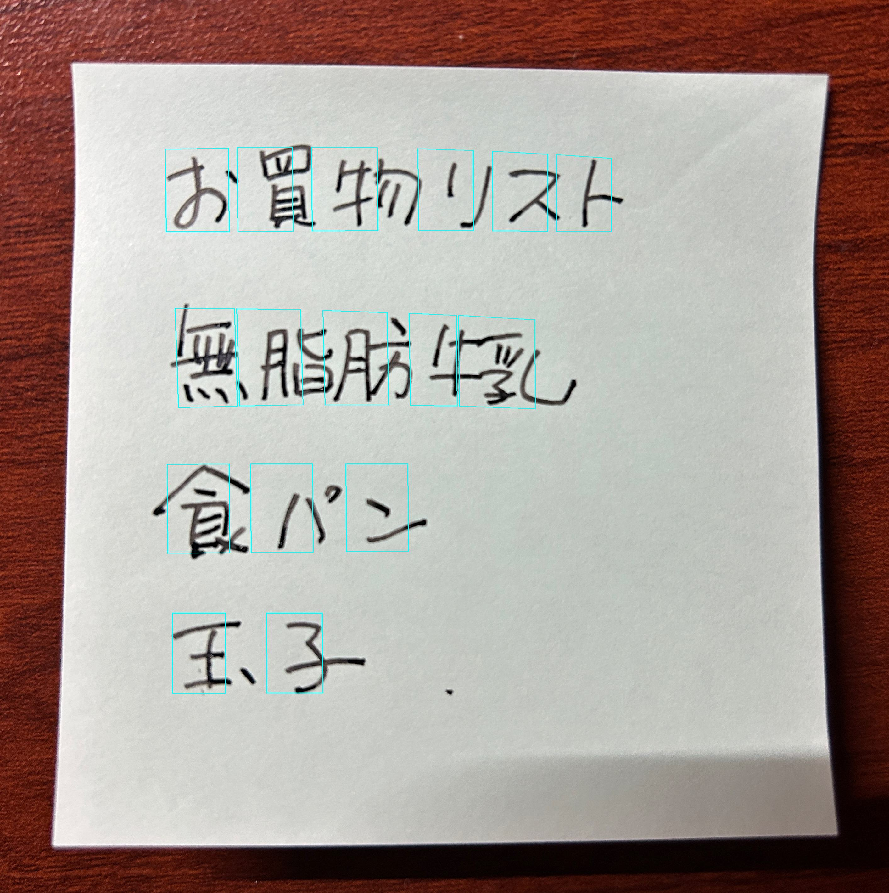

---
lab:
    title: '画像内のテキストを読み取る'
    module: 'Module 11 - 画像やドキュメント内のテキストを読み取る'
---

# 画像内のテキストを読み取る

光学文字認識（OCR）は、画像やドキュメント内のテキストを読み取るコンピュータビジョンの一部です。**Azure AI Vision**サービスは、テキストを読み取るためのAPIを提供しており、この演習でそれを探ります。

## このコースのリポジトリをクローンする

まだ行っていない場合は、このコースのコードリポジトリをクローンしてください。

1. Visual Studio Codeを起動します。
2. パレット（SHIFT+CTRL+P）を開き、**Git: Clone**コマンドを実行して、`https://github.com/MicrosoftLearning/mslearn-ai-vision`リポジトリをローカルフォルダーにクローンします（フォルダーはどこでも構いません）。
3. リポジトリがクローンされたら、Visual Studio Codeでフォルダーを開きます。
4. リポジトリ内のC#コードプロジェクトをサポートするために追加のファイルがインストールされるのを待ちます。

    > **注意**: ビルドとデバッグに必要なアセットを追加するように求められた場合は、**Not Now**を選択します。*Detected an Azure Function Project in folder*というメッセージが表示された場合は、そのメッセージを安全に閉じることができます。

## Azure AI サービス リソースをプロビジョニングする

まだサブスクリプションにない場合は、**Azure AI サービス**リソースをプロビジョニングする必要があります。

1. `https://portal.azure.com` で Azure ポータルを開き、Azure サブスクリプションに関連付けられている Microsoft アカウントでサインインします。
2. 上部の検索バーで「Azure AI services」を検索し、**Azure AI Services**を選択します。次の設定で **Azure AI Services multi-service account** リソースを作成してください。
    - **サブスクリプション**: *あなたの Azure サブスクリプション*
    - **リソース グループ**: *リソース グループを選択または作成します（制限されたサブスクリプションを使用している場合、新しいリソース グループを作成する権限がないかもしれません。その場合は提供されたものを使用してください）*
    - **リージョン**: *利用可能なリージョンを選択します*
    - **名前**: *一意の名前を入力します*
    - **価格レベル**: Standard S0
      
3. 必要なチェックボックスを選択し、リソースを作成します。
4. デプロイが完了するのを待ち、デプロイの詳細を表示します。
5. リソースがデプロイされたら、それに移動して **キーとエンドポイント** ページを表示します。次の手順でエンドポイントとキーの1つが必要になります。

1. Visual Studio Code の **エクスプローラー** ペインで **Libfiles\05-ocr** フォルダーに移動し、使用する言語に応じて **C-Sharp** または **Python** フォルダーを展開します。
2. **read-text** フォルダーを右クリックして統合ターミナルを開きます。その後、使用する言語に応じて以下のコマンドを実行して Azure AI Vision SDK パッケージをインストールしてください。
   
    **C#**

    ```
    dotnet add package Azure.AI.Vision.ImageAnalysis -v 1.0.0-beta.3
    ```

    > **注意**: 開発キットの拡張機能をインストールするように求められた場合は、そのメッセージを安全に閉じることができます。

    **Python**

    ```
    pip install azure-ai-vision-imageanalysis==1.0.0b3
    ```

3. **read-text** フォルダーの内容を確認し、設定ファイルが含まれていることを確認してください。

    - **C#**: appsettings.json
    - **Python**: .env

    設定ファイルを開き、Azure AI サービスリソースの **エンドポイント** と認証 **キー** を反映するように設定値を変更します。変更したら保存してください。

## Azure AI Vision SDKを使って画像からテキストを読み取る

**Azure AI Vision SDK**には、画像からテキストを読み取る機能があります。この演習では、Azure AI Vision SDKを使用して画像からテキストを読み取るクライアントアプリケーションを作成します。未完成のコードの中身を埋めることで、アプリケーションを完成させましょう。

1. **read-text** フォルダーには、クライアントアプリケーションのコードファイルが含まれています。
   
    - **C#**: Program.cs
    - **Python**: read-text.py

        コードファイルを開き、既存の名前空間参照の下にあるコメント **Import namespaces** を見つけてください。その後、このコメントの下に、Azure AI Vision SDKを使用するために必要な名前空間をインポートするための以下のコードを追加します。

    **C#**
    
    ```C#
    // Import namespaces
    using Azure.AI.Vision.ImageAnalysis;
    ```
    
    **Python**
    
    ```Python
    # import namespaces
    from azure.ai.vision.imageanalysis import ImageAnalysisClient
    from azure.ai.vision.imageanalysis.models import VisualFeatures
    from azure.core.credentials import AzureKeyCredential
    ```

2. クライアントアプリケーションのコードファイルで、**Main** 関数内に設定を読み込むコードが提供されています。その後、**Authenticate Azure AI Vision client** というコメントを見つけてください。このコメントの下に、Azure AI Vision クライアントオブジェクトを作成して認証するための以下の言語別のコードを追加します。
   
    **C#**
    
    ```C#
    // Authenticate Azure AI Vision client
    ImageAnalysisClient client = new ImageAnalysisClient(
        new Uri(aiSvcEndpoint),
        new AzureKeyCredential(aiSvcKey));
    ```
    
    **Python**
    
    ```Python
    # Authenticate Azure AI Vision client
    cv_client = ImageAnalysisClient(
        endpoint=ai_endpoint,
        credential=AzureKeyCredential(ai_key)
    )
    ```

3. **Main** 関数内で、先ほど追加したコードの下に、画像ファイルのパスを指定し、そのパスを **GetTextRead** 関数に渡すコードがあることに注意してください。この関数はまだ完全には実装されていません。

4. **GetTextRead** 関数の本文にコードを追加しましょう。**Use Analyze image function to read text in image** というコメントを見つけてください。その後、このコメントの下に、`Analyze` 関数を呼び出す際に視覚的な特徴を指定する以下の言語別のコードを追加します。
   
    **C#**

    ```C#
    // Use Analyze image function to read text in image
    ImageAnalysisResult result = client.Analyze(
        BinaryData.FromStream(stream),
        // Specify the features to be retrieved
        VisualFeatures.Read);
    
    stream.Close();
    
    // Display analysis results
    if (result.Read != null)
    {
        Console.WriteLine($"Text:");
    
        // Prepare image for drawing
        System.Drawing.Image image = System.Drawing.Image.FromFile(imageFile);
        Graphics graphics = Graphics.FromImage(image);
        Pen pen = new Pen(Color.Cyan, 3);
        
        foreach (var line in result.Read.Blocks.SelectMany(block => block.Lines))
        {
            // Return the text detected in the image
    
    
        }
            
        // Save image
        String output_file = "text.jpg";
        image.Save(output_file);
        Console.WriteLine("\nResults saved in " + output_file + "\n");   
    }
    ```
    
    **Python**
    
    ```Python
    # Use Analyze image function to read text in image
    result = cv_client.analyze(
        image_data=image_data,
        visual_features=[VisualFeatures.READ]
    )

    # Display the image and overlay it with the extracted text
    if result.read is not None:
        print("\nText:")

        # Prepare image for drawing
        image = Image.open(image_file)
        fig = plt.figure(figsize=(image.width/100, image.height/100))
        plt.axis('off')
        draw = ImageDraw.Draw(image)
        color = 'cyan'

        for line in result.read.blocks[0].lines:
            # Return the text detected in the image

            
        # Save image
        plt.imshow(image)
        plt.tight_layout(pad=0)
        outputfile = 'text.jpg'
        fig.savefig(outputfile)
        print('\n  Results saved in', outputfile)
    ```

5. **GetTextRead** 関数に追加したコードの中で、**Return the text detected in the image** コメントの下に次のコードを追加してください。このコードは画像のテキストをコンソールに表示し、画像のテキストを強調表示する **text.jpg** という画像を生成します。

    **C#**
    
    ```C#
    // Return the text detected in the image
    Console.WriteLine($"   '{line.Text}'");
    
    // Draw bounding box around line
    var drawLinePolygon = true;
    
    // Return the position bounding box around each line
    
    
    
    // Return each word detected in the image and the position bounding box around each word with the confidence level of each word
    
    
    
    // Draw line bounding polygon
    if (drawLinePolygon)
    {
        var r = line.BoundingPolygon;
    
        Point[] polygonPoints = {
            new Point(r[0].X, r[0].Y),
            new Point(r[1].X, r[1].Y),
            new Point(r[2].X, r[2].Y),
            new Point(r[3].X, r[3].Y)
        };
    
        graphics.DrawPolygon(pen, polygonPoints);
    }
    ```
    
    **Python**
    
    ```Python
    # Return the text detected in the image
    print(f"  {line.text}")    
    
    drawLinePolygon = True
    
    r = line.bounding_polygon
    bounding_polygon = ((r[0].x, r[0].y),(r[1].x, r[1].y),(r[2].x, r[2].y),(r[3].x, r[3].y))
    
    # Return the position bounding box around each line
    
    
    # Return each word detected in the image and the position bounding box around each word with the confidence level of each word
    
    
    # Draw line bounding polygon
    if drawLinePolygon:
        draw.polygon(bounding_polygon, outline=color, width=3)
    ```

6. **read-text/images** フォルダーで **Lincoln.jpg** を選択して、コードが処理するファイルを確認します。

    

7. アプリケーションのコードファイルで、**Main** 関数内のコードを確認し、ユーザーがメニューオプション **1** を選択した場合に実行されるコードを見つけます。このコードは **GetTextRead** 関数を呼び出し、*Lincoln.jpg* 画像ファイルのパスを渡します。

8. 変更を保存し、**read-text** フォルダーの統合ターミナルに戻り、次のコマンドを入力してプログラムを実行します。
   
    **C#**
    
    ```
    dotnet run
    ```
    
    **Python**
    
    ```
    python read-text.py
    ```

9. プログラムが実行されたら、**1** を入力して、画像から抽出されたテキストを確認してください。

    *実行結果 (Python)*
    

10. **read-text** フォルダーで **text.jpg** 画像を選択し、各テキストの *行* の周りにポリゴン（多角形）が描かれていることを確認します。
    
    

11. Visual Studio Code のコードファイルに戻り、コメント **Return the position bounding box around each line** を見つけてください。その後、このコメントの下に次のコードを追加します。
    
    **C#**
    
    ```C#
    // Return the position bounding box around each line
    Console.WriteLine($"   Bounding Polygon: [{string.Join(" ", line.BoundingPolygon)}]");  
    ```
    
    **Python**
    
    ```Python
    # Return the position bounding box around each line
    print("   Bounding Polygon: {}".format(bounding_polygon))
    ```
12. 変更を保存し、**read-text** フォルダーの統合ターミナルに戻り、次のコマンドを入力してプログラムを実行します。
    
    **C#**
    
    ```
    dotnet run
    ```
    
    **Python**
    
    ```
    python read-text.py
    ```
13. プログラムが実行されたら、**1** を入力してください。画像内の各行のテキストとその位置が出力されることを確認してください。
    
    *実行結果 (Python)*
    

14. Visual Studio Code のコードファイルに戻り、コメント **Return each word detected in the image and the position bounding box around each word with the confidence level of each word** を見つけてください。その後、このコメントの下に次のコードを追加します。

    **C#**
    
    ```C#
    // Return each word detected in the image and the position bounding box around each word with the confidence level of each word
    foreach (DetectedTextWord word in line.Words)
    {
        Console.WriteLine($"     Word: '{word.Text}', Confidence {word.Confidence:F4}, Bounding Polygon: [{string.Join(" ", word.BoundingPolygon)}]");
        
        // Draw word bounding polygon
        drawLinePolygon = false;
        var r = word.BoundingPolygon;
    
        Point[] polygonPoints = {
            new Point(r[0].X, r[0].Y),
            new Point(r[1].X, r[1].Y),
            new Point(r[2].X, r[2].Y),
            new Point(r[3].X, r[3].Y)
        };
    
        graphics.DrawPolygon(pen, polygonPoints);
    }
    ```
    
    **Python**
    
    ```Python
    # Return each word detected in the image and the position bounding box around each word with the confidence level of each word
    for word in line.words:
        r = word.bounding_polygon
        bounding_polygon = ((r[0].x, r[0].y),(r[1].x, r[1].y),(r[2].x, r[2].y),(r[3].x, r[3].y))
        print(f"    Word: '{word.text}', Bounding Polygon: {bounding_polygon}, Confidence: {word.confidence:.4f}")
    
        # Draw word bounding polygon
        drawLinePolygon = False
        draw.polygon(bounding_polygon, outline=color, width=3)
    ```

15. 変更を保存し、**read-text** フォルダーの統合ターミナルに戻り、次のコマンドを入力してプログラムを実行します。

    **C#**
    
    ```
    dotnet run
    ```
    
    **Python**
    
    ```
    python read-text.py
    ```
16. プロンプトが表示されたら、**1** を入力して出力を確認します。画像内の各単語のテキストとその位置が表示されるはずです。各単語の信頼度も表示されることに注意してください。

    *実行結果 (Python)*
    

17. **read-text** フォルダーで **text.jpg** 画像を選択し、各単語の周りにポリゴン（多角形）が描かれていることを確認します。

    

## Azure AI Vision SDKを使って手書きのテキストを画像から読み取る

前の演習では、画像からはっきりとしたテキストを読み取りましたが、手書きのメモや紙からテキストを読み取りたい場合もあります。幸いなことに、**Azure AI Vision SDK**は、手書きのテキストも同じコードで読み取ることができます。前の演習で使用したコードをそのまま使いますが、今回は別の画像を使用します。

1. **read-text/images** フォルダーで **Note.jpg** を選択して、コードが処理するファイルを確認します。

    

2. アプリケーションのコードファイルで、**Main** 関数内のコードを確認し、ユーザーがメニューオプション **2** を選択した場合に実行されるコードを見つけます。このコードは **GetTextRead** 関数を呼び出し、*Note.jpg* 画像ファイルのパスを渡します。

3. **read-text** フォルダーの統合ターミナルで、次のコマンドを入力してプログラムを実行します。

    **C#**
    
    ```
    dotnet run
    ```
    
    **Python**
    
    ```
    python read-text.py
    ```

4. プロンプトが表示されたら、**2** を入力して出力を確認します。これは、ノート画像から抽出されたテキストです。

    *実行結果 (Python)*
    

5. **read-text** フォルダーで **text.jpg** 画像を選択し、ノートの各単語の周りにポリゴンが描かれていることを確認します。
   
   

## 日本語文字を読み取る

ここまでの演習で英語の文字列は読み取れることを確認しました。それでは日本語の文字列はどうでしょうか？幸いなことにAzure AI Vision は日本語の読み取りにも対応しています。ただし、英語のように単語の区切りにスペースがないため、英語とは少し挙動が異なります。さらに日本語の縦書きはどうでしょうか？実験してみましょう。

1. **read-text\images** フォルダーに日本語の文字を含む画像がいくつか保存されていることを確認してください。

   - **Note_jp.jpg**: 日本語のお買い物リストの画像
     
   - **Tategaki_jp.jpg**: 日本語の縦書きで書かれた掲示板の画像
      

2. Visual Studio Code のコードファイルに戻り、コメント ****Menu for text reading functions**** を見つけてください。画像ファイルを読みこむ部分を探し、上記の画像ファイル名に書き換えてください。

    **C#**

    ```C#
    // Menu for text reading functions
    Console.WriteLine("\n1: Use Read API for image (Tategaki_jp.jpg)\n2: Read handwriting (Note_jp.jpg)\nAny other key to quit\n");
    Console.WriteLine("Enter a number:");
    string command = Console.ReadLine();
    string imageFile;

    switch (command)
    {
        case "1":
            imageFile = "images/Tategaki_jp.jpg";
            GetTextRead(imageFile, client);
            break;
        case "2":
            imageFile = "images/Note_jp.jpg";
            GetTextRead(imageFile, client);
            break;
        default:
            break;
    }
    ```

    **Python**

    ```Python
    # Menu for text reading functions
    print('\n1: Use Read API for image (Tategaki_jp.jpg)\n2: Read handwriting (Note_jp.jpg)\nAny other key to quit\n')
    command = input('Enter a number:')
    if command == '1':
        image_file = os.path.join('images','Tategaki_jp.jpg')
        GetTextRead(image_file)
    elif command =='2':
        image_file = os.path.join('images','Note_jp.jpg')
        GetTextRead(image_file)
    ```

3. **read-text** フォルダーの統合ターミナルで、次のコマンドを入力してプログラムを実行します。

    **C#**
    
    ```
    dotnet run
    ```
    
    **Python**
    
    ```
    python read-text.py
    ```

4. プロンプトが表示されたら、**2** を入力して出力を確認します。これは、ノート画像から抽出されたテキストです。

    *実行結果 (Python)*
    

    日本語の場合、１行の文章は正しく認識されるものの、英語のように単語間にスペースがないため一文字ずつ認識されることがわかります。

5. **read-text** フォルダーで **text.jpg** 画像を選択し、Visual Studio Codeで表示してください。各文字の周りにポリゴンが描かれていることが確認できます。
   
   

6. 同様に、実行時のプロンプトで **1** を入力して、縦書きの文字も認識できるかどうか試してください。

## リソースのクリーンアップ

このラボで作成した Azure リソースを他のトレーニングモジュールで使用しない場合は、追加の料金が発生しないように削除することができます。以下の手順で行います。

1. `https://portal.azure.com` で Azure ポータルを開き、Azure サブスクリプションに関連付けられている Microsoft アカウントでサインインします。

2. 上部の検索バーで「Azure AI services multi-service account」を検索し、このラボで作成した Azure AI services multi-service account リソースを選択します。

3. リソースページで **削除** を選択し、指示に従ってリソースを削除します。

## 詳細情報

**Azure AI Vision** サービスを使ってテキストを読み取る方法については、[Azure AI Vision ドキュメント](https://learn.microsoft.com/azure/ai-services/computer-vision/concept-ocr)をご覧ください。
