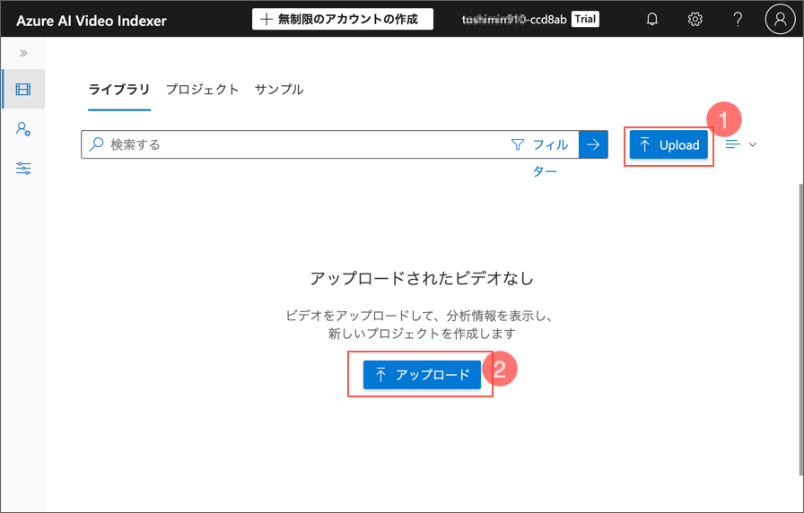

---
lab:
    title: '動画を分析する'
    module: 'Module 8 - Azure AI Vision でコンピューター ビジョン ソリューションを作成する'
---

# Video Indexer で動画を分析する

昨今、制作および利用されるデータの大部分は動画形式となっています。**Azure AI Video Indexer** は、動画をインデックス化し、そこから分析情報を抽出するために使用できる AI 搭載のサービスです。

> **注意**: 2022年6月21日以降、Azure AI サービスの機能で個人を特定できる情報を返すものは、[限定アクセス](https://docs.microsoft.com/azure/cognitive-services/cognitive-services-limited-access)を許可された顧客に制限されています。限定アクセスの承認を得ないと、このラボで Video Indexer を使用して人や有名人を認識することはできません。Microsoft が行った変更とその理由の詳細については、[顔認識のための責任ある AI 投資と安全対策](https://azure.microsoft.com/blog/responsible-ai-investments-and-safeguards-for-facial-recognition/)をご覧ください。

## このコースのリポジトリをクローンする

まだ行っていない場合は、このコースのコードリポジトリをクローンしてください。

1. Visual Studio Codeを起動します。
2. パレット（SHIFT+CTRL+P）を開き、**Git: Clone**コマンドを実行して、`https://github.com/MicrosoftLearning/mslearn-ai-vision`リポジトリをローカルフォルダーにクローンします（フォルダーはどこでも構いません）。
3. リポジトリがクローンされたら、Visual Studio Codeでフォルダーを開きます。
4. リポジトリ内のC#コードプロジェクトをサポートするために追加のファイルがインストールされるのを待ちます。

    > **注意**: ビルドとデバッグに必要なアセットを追加するように求められた場合は、**Not Now**を選択します。*Detected an Azure Function Project in folder*というメッセージが表示された場合は、そのメッセージを安全に閉じることができます。

## 動画を Video Indexer にアップロードする

まず、Video Indexer ポータルにサインインして動画をアップロードします。

> **ヒント**: ホストされたラボ環境で Video Indexer ページの読み込みが遅い場合は、ローカルにインストールされたブラウザーを使用してください。後のタスクでは再びホストされた VM に戻ることができます。

1. ブラウザーで Video Indexer ポータルを開きます: `https://www.videoindexer.ai`
2. 既存の Video Indexer アカウントがある場合はサインインします。ない場合は、無料アカウントにサインアップし、Microsoft アカウント（または他の有効なアカウント）でサインインします。サインインに問題がある場合は、プライベートブラウザセッションを試してください。

    

3. 新しいタブで `https://aka.ms/responsible-ai-video` にアクセスして Responsible AI ビデオをダウンロードします。ファイルを保存します。
4. Video Indexer で **アップロード** オプションを選択します。次に **ファイルを参照** オプションを選択し、ダウンロードしたビデオを選択して **追加** をクリックします。デフォルトの名前を **Responsible AI** に変更し、デフォルト設定を確認し、Microsoft の顔認識ポリシーに準拠していることを確認するチェックボックスを選択して、ファイルをアップロードします。

    
    
    
    

5. ファイルのアップロードが完了したら、Video Indexer が自動的にインデックスを作成するまで数分待ちます。
   
    

> **注意**: この演習では、Video Indexer の機能を探るためにこのビデオを使用しますが、演習が終わったらビデオを最後まで視聴してください。AI を活用したアプリケーションを責任を持って開発するための有用な情報とガイダンスが含まれています！

## 動画のインサイトを確認する

インデックス作成プロセスは、動画からインサイトを抽出し、ポータルで確認できます。

1. Video Indexer ポータルで動画がインデックス化されたら、それを選択して表示します。動画プレーヤーの横に、動画から抽出された分析情報を表示するペインが表示されます。

    > **注意**: 個人の識別情報を保護するための限定アクセスポリシーにより、動画をインデックス化しても名前が表示されない場合があります。

    

2. 動画が再生されている間に、**Timeline (タイムライン)** タブを選択して、動画の音声の文字起こしを表示します。
    

3. ポータルの右上にある **分析情報の表示** アイコン（&#128455;のような形）を選択し、インサイトのリストで **トランスクリプト** に加えて **OCR** と **話者** を選択します。

    

4. **タイムライン** ペインには次の内容が含まれます:
    - 音声ナレーションの文字起こし
    - 動画内で見えるテキスト
    - 動画に登場する話者：一部の有名な人は名前で自動的に認識され、他の人は番号（例：*話者 #1*）で表示されます。
5. **分析情報** ペインに戻り、表示されているインサイトを確認します。これには次の内容が含まれます:
    - 動画に登場する個々の人物
    - 動画で話されているトピック
    - 動画に登場するオブジェクトのラベル
    - 動画に登場する人やブランドなどの名前付きエンティティ
    - 重要なシーン
6. **分析情報** ペインを表示した状態で、再度 **分析情報の表示** アイコンを選択し、分析情報分析のリストで **キーワード** と **感情** をペインに追加します。

    見つかったインサイトは、動画の主要なテーマを把握するのに役立ちます。例えば、この動画の **トピック** は、Environment, Education, Technologyについての内容であることが明確に示されています。

## Search for insights
Video Indexer を使って動画のインサイトを検索することができます。

1. **インサイト** ペインの **検索** ボックスに「Bee」と入力します。インサイト ペインをスクロールして、すべての種類のインサイトの結果を確認してください。
2. 1つの一致する *ラベル* が見つかり、その位置が動画の下に表示されます。
3. 蜂がいることが示されているセクションの始まりを選択し、その時点で動画を再生します（動画を一時停止して慎重に選択する必要があるかもしれません - 蜂は一瞬しか現れません！）
4. **検索** ボックスをクリアして、動画のすべてのインサイトを表示します。

    

## Video Indexer ウィジェットを使用する

Video Indexer ポータルは、動画のインデックス作成プロジェクトを管理するための便利なインターフェースです。しかし、Video Indexer アカウントにアクセスできない人々にも動画とそのインサイトを提供したい場合があります。Video Indexer は、この目的のためにウェブページに埋め込むことができるウィジェットを提供しています。

1. Visual Studio Code で、**06-video-indexer** フォルダー内の **analyze-video.html** を開きます。このファイルは Video Indexer の **Player** と **Insights** ウィジェットを追加するための基本的な HTML ページです。ヘッダーにある **vb.widgets.mediator.js** スクリプトの参照に注意してください。このスクリプトは、ページ上の複数の Video Indexer ウィジェットが相互に連携するために使用されます。

    

2. Video Indexer ポータルで、**メディアファイル** ページに戻り、**Responsible AI** ビデオを開きます。
3. ビデオプレーヤーの下にある **&lt;/&gt; 埋め込み** を選択して、ウィジェットを埋め込むための HTML iframe コードを表示します。
4. **共有と埋め込み** ダイアログボックスで、**プレーヤー** ウィジェットを選択し、ビデオのサイズを 560 x 315 に設定して、埋め込みコードをクリップボードにコピーします。

    

5. Visual Studio Code の **analyze-video.html** ファイルで、コメント **&lt;-- Player widget goes here --&gt;** の下にコピーしたコードを貼り付けます。
   
    

6. **共有と埋め込み** ダイアログボックスに戻り、**Insights** ウィジェットを選択して、埋め込みコードをクリップボードにコピーします。ダイアログボックスを閉じ、Visual Studio Code に戻って、コメント **&lt;-- Insights widget goes here --&gt;** の下にコピーしたコードを貼り付けます。

    

    

7. ファイルを保存します。次に、**エクスプローラー** ペインで **analyze-video.html** を右クリックし、Windowsの場合は**ファイルエクスプローラーで表示します**、MacOSの場合は **Finderで表示します** を選択します。

    

8. **analyze-video.html** をブラウザーで開き、ウェブページを確認します。

    

9. ウィジェットを使ってみて、**Insights** ウィジェットを使ってインサイトを検索し、ビデオ内の該当箇所にジャンプします。

    

## Video Indexer REST API を使用する

Video Indexer は、REST API を提供しており、これを使用してアカウント内の動画をアップロードおよび管理することができます。

### API 詳細情報を取得する

Video Indexer API を使用するには、リクエストを認証するための情報が必要です。

1. Video Indexer ポータルで、左側のペインを展開し、**アカウント設定** ページを選択します。
2. このページに表示されている **アカウント ID** をメモしておきます。後で必要になります。

    

3. 新しいブラウザタブを開き、`https://api-portal.videoindexer.ai` の Video Indexer 開発者ポータルにアクセスし、Video Indexer アカウントの資格情報を使用してサインインします。

    

4. **Profile** ページで、あなたのプロフィールに関連付けられている **サブスクリプション** を確認します。
5. サブスクリプションのページで、各サブスクリプションに対してプライマリキーとセカンダリキーの2つのキーが割り当てられていることを確認します。任意のキーの **Show (表示)** を選択してキーを表示します。このキーは後で必要になります。

    

### REST API を使用する

アカウント ID と API キーを取得したので、REST API を使用してアカウント内の動画を操作できます。この手順では、PowerShell スクリプトを使用して REST 呼び出しを行いますが、cURL や Postman などの HTTP ユーティリティ、または HTTP 経由で JSON を送受信できる任意のプログラミング言語でも同じ原則が適用されます。

Video Indexer REST API とのすべてのやり取りは同じパターンになります。

- 最初のリクエストで、API キーをヘッダーに含めて **AccessToken** メソッドを呼び出し、アクセストークンを取得します。
- その後のリクエストでは、アクセストークンを使用して認証し、REST メソッドを呼び出して動画を操作します。

1. Visual Studio Code で、**06-video-indexer** フォルダー内の **get-videos.ps1** を開きます。Mac OSの場合は **get-videos.sh**を開いてください。

2. スクリプト内の **YOUR_ACCOUNT_ID** と **YOUR_API_KEY** のプレースホルダーを、先ほど確認したアカウント ID と API キーの値に置き換えます。
3. 無料アカウントの *location* は "trial" です。制限のない Video Indexer アカウント（関連する Azure リソースを持つ）を作成した場合は、Azure リソースがプロビジョニングされている場所（例: "eastus"）に変更できます。
4. スクリプト内のコードを確認し、2 つの REST メソッドを呼び出していることに注意してください。1 つはアクセストークンを取得するためのもので、もう 1 つはアカウント内の動画をリストするためのものです。

    *get-videos.ps1*
    

    *get-videos.sh*
    

5. 変更を保存し、スクリプトペインの右上にある **&#9655;** ボタンを使用してスクリプトを実行します。
6. REST サービスからの JSON レスポンスを表示し、以前にインデックス化した **Responsible AI** 動画の詳細が含まれていることを確認します。

    *実行結果の一部*
    

## 詳細情報

人や有名人の認識はまだ利用可能ですが、[責任ある AI 標準](https://aka.ms/aah91ff)に従って、これらは限定アクセスポリシーのもとで制限されています。これらの機能には、顔の識別や有名人の認識が含まれます。詳細を確認し、アクセスを申請するには、[Azure AI サービスの限定アクセス](https://docs.microsoft.com/azure/cognitive-services/cognitive-services-limited-access)をご覧ください。

**Video Indexer** についての詳細は、[Video Indexer ドキュメント](https://learn.microsoft.com/azure/azure-video-indexer/)を参照してください。
